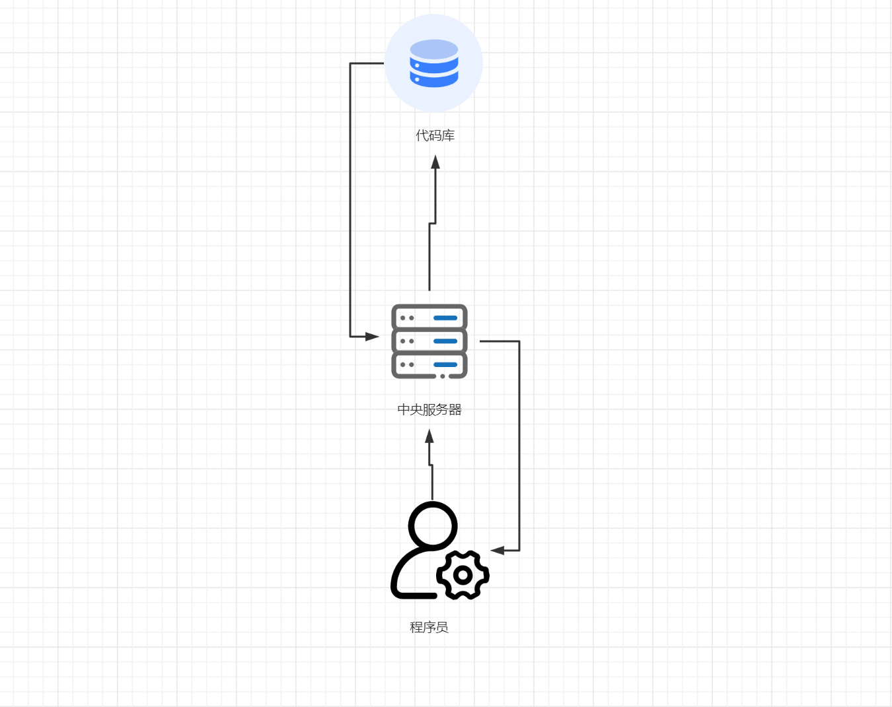
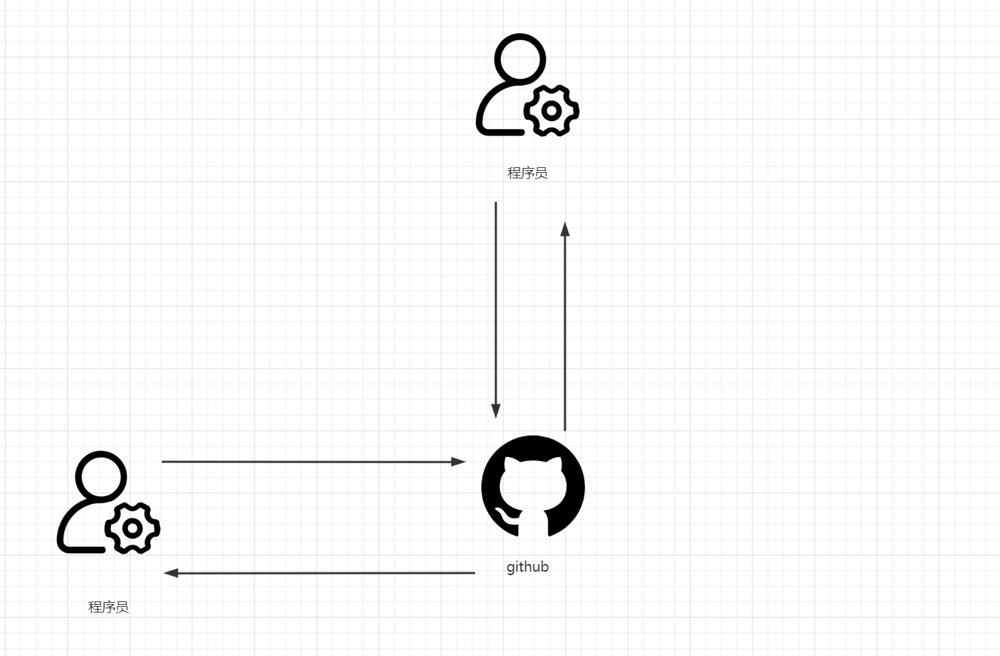

# github和gitlab和gitee什么区别？

```shell
Giehub：国外开源源码托管仓库、全英文、用户基数大。需要科学上网。
Gitlab：企业用的多、闭源、私服，需要自己搭建。
Gitee(码云)：国内、优秀的库少
```

# git和svn什么区别？

```shell
SVN：支持集中式管理、分布式管理
Git：分布式管理
```

# 什么是集中式管理？集中式管理优缺点？



```
优点：简单的结构、便于备份和管理
缺点：服务器出现问题，影响所有的程序员
```

# 什么是分布式管理？分布式管理优缺点？



```
优点：本地进行开发和版本控制、开发相互合作更灵活。数据安全性好
```

