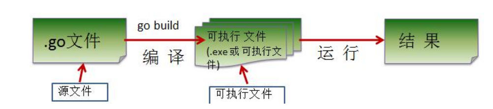

### Golang 的语言的特点

> Go语言保证了既能到达静态编译语言的安全和性能，又达到了动态语言开发维护的高效率使用一个表达式来形容 Go 语言:Go=C+Python，说明 Go 语言既有C 静态语言程序的运行速度，又能达到 Python 动态语言的快速开发。

1.从C语言中继承了很多理念，包括表达式语法，控制结构，基础数据类型，调用参数传值，指针等等，也保留了和 C语言一样的编译执行方式及弱化的指针

2.引入包的概念，用于组织程序结构，Go语言的一个文件都要归属于一个包，而不能单独存在。

3.垃圾回收机制，内存自动回收，不需开发人员管理

4.天然并发(重要特点)

(1).从语言层面支持并发，实现简单

(2).goroutine，轻量级线程，可实现大并发处理，高效利用多核

(3).基于 CPS 并发模型(Communicating Sequential Processes )实现

5.吸收了管道通信机制，形成 Go 语言特有的管道 channel 通过管道 channel，可以实现不同的 goroute之间的相互通信

6.函数可以返回多个值

7.新的创新:比如切片 slice、延时执行 defer

### Golang执行流程有哪些？有什么区别？

> 1.对源码编译后再执行

> 2.对源码直接执行，执行go run

> 区别

1.如果我们先编译生成了可执行文件，那么我们可以将该可执行文件拷贝到没有 go 开发环境的机上，仍然可以运行

2.如果我们是直接 go run go 源代码，那么如果要在另外一个机器上这么运行，也需要go开发环境，否则无法执行。

3.在编译时，编译器会将程序运行依赖的库文件包含在可执行文件中，所以，可执行文件变大了很多。

