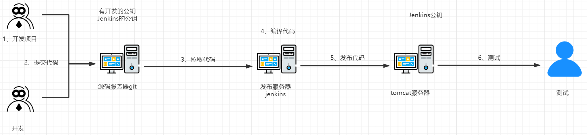

# jenkins工作流程



# jenkins参数化构建是什么？怎么做？

```http
相似问题：你们都用jenkins做什么？
```

```txt
1、概念：
程序员发布代码前，要给代码打标签，这个是为了我们可以进行切换版本。要是版本有bug，可以进行版本回退。

2、步骤
(1)、Gitlab代码仓库准备代码，Jenkins安装插件"Git parameter"
(2)、进入jenkins界面，点击"配置"，找到General选项，选择"参数化构建"。
(3)、添加参数：GIT、描述、排序方式等
(4)、点击源码管理：repository URL链接、指定分支${tag}
(5)、开始构建
```

# jenkins自动化触发构建是什么？怎么做？

```http
相似问题：你们都用jenkins做什么？
```

```
1、概念：
gitlab代码仓库更新代码，jenkins同步更新。适用于更新频繁场景。

2、步骤：
(1)、配置jdk和maven(编译)，指定路径
(2)、安装Gitlab hooks plugins插件
(3)、新建Gitlab webhook项目、构建一个maven项目
(4)、找到General选项，选择"策略"。
(5)、找到源码管理复制gitlab链接到Respository URL
(6)、配置Jenkins私钥到新建项目中，Jenkins公钥配置到Gitlab，免密
(7)、构建触发器，生成Gitlab webhook URl链接、secrect token认证密钥
(8)、将Gitlab webhook UR链接和secrect token认证密钥配置到Gitlab
```

# jenkins安装什么插件？为什么要安装这些插件？

```
1. Git Plugin：从Git仓库拉包
2、Maven Integration Plugin：自动化maven构建，maven自动安装、升级
3、 Build Timeout Plugin：停止构建。设置超时时间，避免浪费资源。
4、Email Extension plugin：邮件通知插件
```

# jenkins打成什么包？

```
打包成war文件以便在web应用服务器部署
```

# jenkins用什么工具进行打包？

```
1. Maven：Maven 可对 Java 项目进行构建、文档生成等操作。
2. Gradle：Gradle 类似 Maven，可以进行 Java 项目的构建、依赖管理等。
```

# jenkins安装ansiber的插件吗？

```
要使用ansible进行自动化构建，需要安装ansible插件。
```

# Jenkins把java语言打成什么包？发到哪里？

```
jenkins把java的maven项目打包成jar/war包，发布到tomcat
```

```
原理：
1、程序员push代码到gitlab，自动触发jenkins job
2、jenkins job把maven项目打包成jar包发布tomcat
```

# 参数化构建的作用？

```
根据业务需求，指定版本号。适用频繁更新和版本切换，保持灵活性，提高构建效率和可靠性。
```

# 编译java代码用什么工具？

```
java编辑器：Oracle Jdk，OpenJdk等。
自动化构建工具：Maven、Gradle
```

# 一般编译用什么参数？

```
Jenkins常见的编译参数包括：
1. 源码路径：指定待编译的源码文件夹。
2. 构建目标：指定构建的目标，比如可执行文件、静态资源等；
3. 编译选项：指定编译使用的选项，如编译器类型、编译优化等；
4. 环境变量：设置环境变量，如PATH变量；
5. 构建参数：如版本号、构建时间等。
```

# 编译打包需要依赖什么文件？

```
1、项目的源代码
2、依赖包：如果项目依赖第三方库或框架
3、构建工具：maven、Gradle进行编译，打包
4、JDK：java运行环境
5、plugin：maven、Git
6、配置文件：如构建版本号、部署环境    
```

# jenkins使用过程中遇到过什么问题？

```
拉取github代码仓库源码包发现拉取不了，github是国外的网站
解决：
在服务器安装了clash配置了经过报备的VPN，就可以访问外网了。
```

# Jenkins的流水线了解吗？

```
Jenkins pipline是将软件开发过程划分多个阶段，每个阶段执行特定的任务，目的是完成软件的开发、测试、构建和部署的工作。

原理：
将软件开发过程划分多个阶段，每个阶段执行特定任务(编译、测试、构建、打包、部署)。流水线会在每个阶段执行前进行检查，确保前置阶段任务完成，以便后续任务的开展。如果某个任务执行失败了，整个流水线会停止工作，需要运维人员去排查。
```

# 你用流水线构建过什么项目？怎么做的？

```
版本参数化构建
1、Jenkins安装Git参数插件"Git Paramter"，新建项目，添加Git参数
2、安装Git应用，关联Github用户和邮箱
3、Git将待发布的代码打上标签Tag，推送到Github
4、Jenkins前端页面，选择General，名称选择Tag，排序方式为倒序
5、添加流水线脚本，点击开始构建，这样可以看到版本Tag，方便后续我们的管理
```

