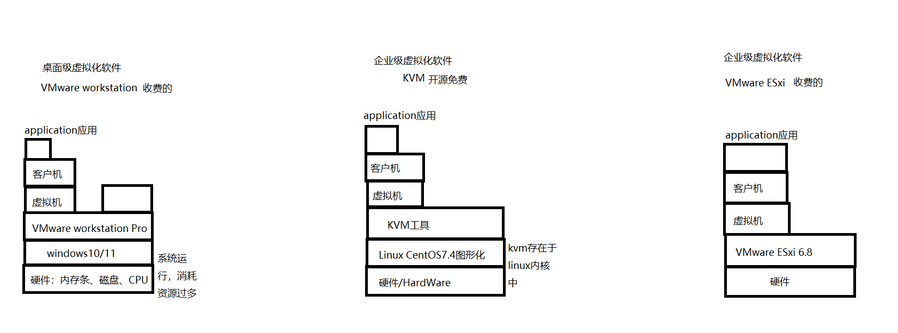

# VMware workstation、KVM、VMware ESxi 区别



# 企业级虚拟化软件和桌面级虚拟化软件的区别？

```
1、适用范围
企业级虚拟化软件：
适用于企业，适用于Linux Centos7操作系统，消耗资源低；Linux自带KVM工具进行虚拟化

桌面级虚拟化软件：
适用于用户个人，适用于Windows操作系统，消耗资源高；

2、功能特性：
企业级虚拟化软件：
功能丰富，例如资源池管理、虚拟化存储和网络

桌面级虚拟化软件：
功能相对单一

3、性能要求：
企业级虚拟化软件性能要求高
桌面级虚拟化软件性能要求低
```

# 企业级虚拟化软件都有哪些？有什么区别？

```
KVM、VMexsi
KVM
开源、国产虚拟化、对入门用户不友好，第三方工具不多，大厂青睐
VMware ESXi
商业版、部署简单、运行稳定、Web页面展示，价格高
```

# 你们是如何管理自己的虚拟机的？

```
适用Virt-manager图形界面进行管理
```


