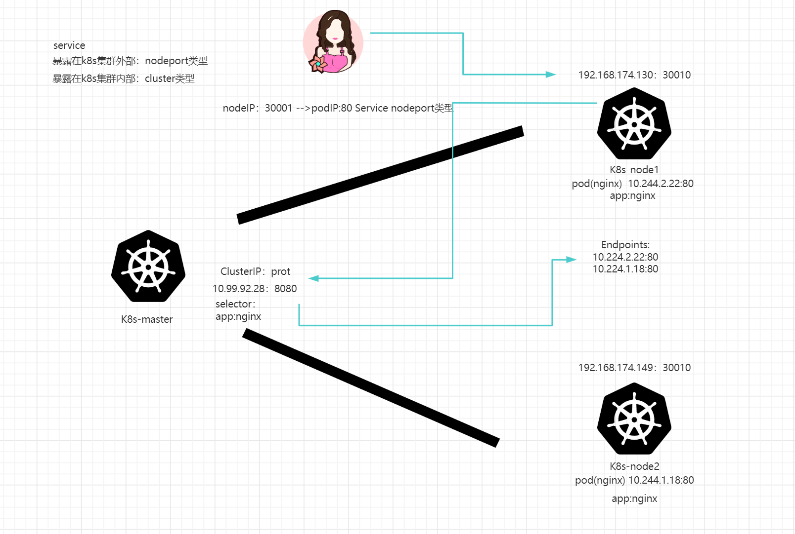

#   k8s有哪些组件？组件的作用分别是什么

```
1、etcd：
存储kubernetes集群的配置数据，pod、节点的信息

2、Apiserver：
kubernetes接口，负责部署、操作

3、controller-manager:
kubernetes控制器，根据控制器配置pod副本数和当前运行的pod实际数量之间的差异，决定启动或删除一个或者多个pod

4、scheduler：
负责提供策略，将新创建的pod分配到集群中最合适的节点上，提高资源利用率

5、kubelet：
每个节点上都有一个kubelet进程，用于管理pod生命周期，会定期检查pod定义描述的要求，确保容器已经启动并保持运行状态

6、kube-proxy：
为service提高网络代理和负载均衡
```

# k8s和docker-compose的区别是什么？

```
kubernetes和docker compose都是容器编排的工具

docker compose是简单的容器编排工具，通过一个yaml文件管理多个docker容器，但是不适合复杂的操作和高可用的要求

kubernetes是复杂和完备的容器编排系统，提供了智能调度、自动扩缩容、服务发现和负载均衡、故障恢复等功能
```

#  k8s的secret资源对象，有什么作用？你是如何使用它的？

```
secret是k8s其中的资源对象，用来存储密码，secret会将密码进行加密，减少风险的暴露
原理：把pod想访问的加密数据放到etcd中，用户可以通过pod容器挂载volume的方式或者环境变量的方式访问secret信息

pod有两种方式去使用secret：
命令行、yaml行

引用方式：
1、卷挂载：
创建pod时，我们将secret内容挂载到容器某个目录，更新secret值，容器会更新

2、映射secret的key到指定的目录
卷挂载前提下，volumes下方定义items，在items下方再定义key以及相对路径，将我们的数据存储指定目录

3、环境变量
比如在创建mysql的pod，使用mysql预定义变量，通过引用环境变量将secret数据定义为mysql的密码
但是，更新secret值，容器里面的值不会更新
```

# k8s的secret和configmap有什么区别？详细的说一下？

```
configmap和secret都是来存储程序或容器的配置信息。

1、数据类型：
configmap储存纯文本数据，secret储存加密后的数据

2、安全性：
secret储存的数据是加密的，可以安全地储存敏感数据

3、使用场景：
configmap储存程序的配置信息，比如说环境变量等，secret储存敏感信息比如数据库的密码
```

# k8s-Service(node port)暴露nginx端口




# 你了解的k8s的pod副本控制器有哪些？有什么区别？

```
1、Deployment：
是kubernetes常用的控制器，用来管理pod复制数、升级和回滚。

2、replicaset：
是kubernetes早期版本控制器，确保pod正在运行，与deployment息息相关，作为deployment控制器底层实现的一部分，不单独使用

3、replication controller=CR与Deployment一样功能，但是不能回滚升级
```

# Service说一下有什么作用？有几种类型？

```
service是k8s一个资源对象，作用是用来暴露pod的

通过创建service，识别pod标签，将带有相同标签的pod放入同一个endpoints，service会生成一个clusterip和端口，通过这个ip和端口访问

默认以轮询的方式访问endpoints中的pod，service会将node节点上的端口暴露出来，端口的范围是30000-32767

通过访问node节点的ip以及暴露出来的端口将请求转发到clusterip，之后再访问到endpoints中的某个pod
```

```
clusterip、nodeport、loadblance、externalName
```

# k8s的镜像拉取策略说一下？

```
Ifnotpresent：
镜像以及存在的前提下，kubelet不再去拉取这个镜像，仅当本地缺失时才会从仓库去拉取这个镜像，是默认的镜像拉取的策略

Alaways:
每次创建pod都会重新拉取这个镜像

NerverPod：
不会主动拉取这个镜像，仅是使用本地的镜像

对于标签为latest的镜像文件，默认镜像获取策略是always
对于其他标签的镜像，默认策略是Ifnotpresent
```

# k8s如何做pod资源限制？

```
常见的是cpu和内存的资源限制
resources：资源管理，在这个模块下进行限制
requests：最低保障，无法去满足，则pod是无法去调度的
limits：最高的限制，任何情况下limits都应该设置为大于或者等与requests
```

# 你了解的k8s资源对象有哪些？说一下？

```
Event：记录事件，用于排错
Namespace：命名空间

Deployment：副本管理器
replication controller=RC：副本管理器，不能进行回滚与热更新

Service：四层负载，为pod提供网络代理和负载均衡，提供统一访问入口
Endpoints：pod的网络代理，存储的是service所有访问的后端pod ip和端口

Label：标签

Configmap：存储配置文件
Secret：用于存储敏感数据

Role：权限集合
Clusterrole：集群权限集合

Daemonset：每个节点都会部署pod
Statefulset：有序创建，有序删除
Storageclass：声明存储插件，用于自动创建pv
ingress：定义如何转发到service的规则，实现反向代理和负载均衡，七层对外暴露入口
```

# k8s的存储都有哪些？什么区别？

```
1. EmptyDir：在Pod本地创建一个空目录来存储数据，由于该目录只在该Pod的生命周期内存在，因此适合于一些短暂的数据存储需求。
2. HostPath：挂载宿主机的路径到Pod中，可以用于访问宿主机上的文件或目录，但是不适合跨节点访问。
3. PV/PVC：PersistentVolumes（PV）和PersistentVolumeClaims（PVC）在Kubernetes中提供了一个抽象层，使得Pod可以使用不同的存储设备而无需关心存储细节。
4. NFS：Network File System（NFS）是一种基于网络的文件系统协议，可以在不同的系统之间共享文件。Kubernetes中可以将NFS挂载到Pod中以共享存储。
5. ConfigMap/Secret：可以将配置文件或敏感信息存储到Kubernetes中的ConfigMap或Secret中，以供Pod访问。
6. CSI：Container Storage Interface（CSI）是一种标准接口，允许存储提供商以插件的形式创建自己的存储驱动。
7. StatefulSet：StatefulSet是Kubernetes中的一个控制器，可以保证Pod按照顺序启动和停止，适合有状态的应用程序的存储需求。它配合PV/PVC使用可以保证Pod的数据持久化。
```

# pod的亲和性和反亲和性有什么作用？

```
是k8s的调度机制 控制pod在节点上的调度位置
确保应用程序的可用性 提高应用程序性能 降低应用程序故障率
```

