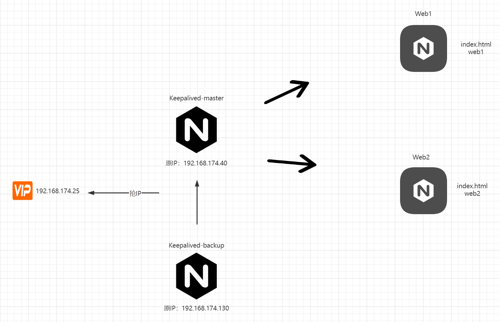
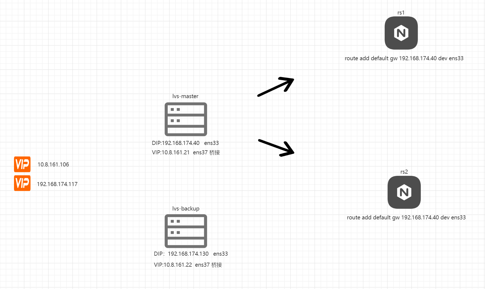

# LVS负载均衡流程图


# 四层负载均衡与七层负载均衡的区别？

```shell
|          | 四层负载均衡              | 七层负载均衡                               |
+----------+-------------------------+----------------------------------------------+
| 基于      | 基于IP+Port的           | 基于URL或主机IP等。                        |
+----------+-------------------------+----------------------------------------------+
| 类似于    | 路由器                   | 代理服务器                                     |
+----------+-------------------------+----------------------------------------------+
| 复杂度    | 低                      | 高                                           |
+----------+-------------------------+----------------------------------------------+
| 性能     | 高；无需解析内容           | 中；需要算法识别 URL和 HTTP head 等信息 |
+----------+-------------------------+----------------------------------------------+
| 安全性   | 低，                      | 高，                                        |
+----------+-------------------------+----------------------------------------------+
| 额外功能  | 无                       | 会话保持，图片压缩，防盗链、地址重写、流量限制等
```

# Nginx+Keepalived负载均衡原理是什么？



# LVS_Director + KeepAlived


# Mysql+keepalived


# LVS-Nat模式+Keepalived



# nginx和lvs有什么区别？

```
nginx和lvs都是负载均衡工具
区别：
1、功能不同：
nginx是web服务器、反向代理服务器、负载均衡器分配请求到不同的web服务器上，实现高可用和更快的速度。
lvs是软件负载均衡器，是通过ip去实现负载均衡的。

2、算法不同：
nginx支持负载均衡算法包括，轮询、ip hash
lvs支持负载均衡算法包括，轮询、源地址hash

3、部署方式不同
nginx是将服务分离，通过代理去转发请求，需要在每个web服务器上部署nginx
lvs通过ip负载均衡实现

4、协议不同：
nginx支持http和https协议
lvs支持TCP、UDP、FTP协议
```

# DR模式和NAT模式的区别？

```
主要区别：
1、VIP使用方式
2、负载均衡器和后端服务器通信方式

DR模式：
VIP绑定到RS上，LVS负责将请求包转发给RS，将响应包的源IP地址改为VIP发送客户端，DR模式效率高。

NAT模式：
VIP绑定到LVS物理网卡上。LVS接受请求包时，将请求包目标ip地址改为一个rs的ip地址，并发给rs。
rs响应源ip地址改为vip发送回lvs。lvs将响应包的源ip地址改为客户端ip地址，发送给客户端。
这个模式不需要rs绑定vip，但lvs要维护vip和rs映射表，效率低。

综上：
DR模式要求RS绑定VIP，效率高，NAT模式不需要RS绑定VIP，效率低。
```

# LVS四种工作模式是什么？有什么区别？

```
1、NAT模式(LVS-NAT)
2、直接路由(Direct Routing)模式(LVS-DR)
3、IP隧道(Tunnel)模式(LVS-TUN)
4、FULL-NAT模式(双向转换模式)


DR模式和NAT模式的区别
```

# 你们怎么解决单节点机器故障的问题？

```
集群技术：
sentinel，cluster，LVS负载均衡，nginx+keepalived高可用
master出现宕机，slave可顶上去，实现故障转移
```

