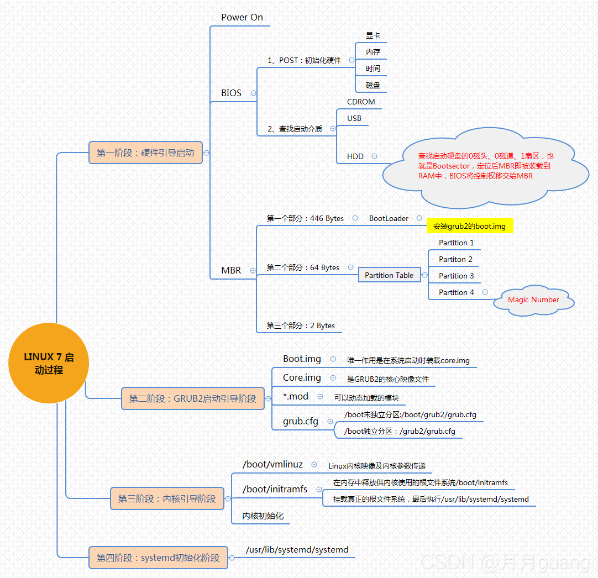
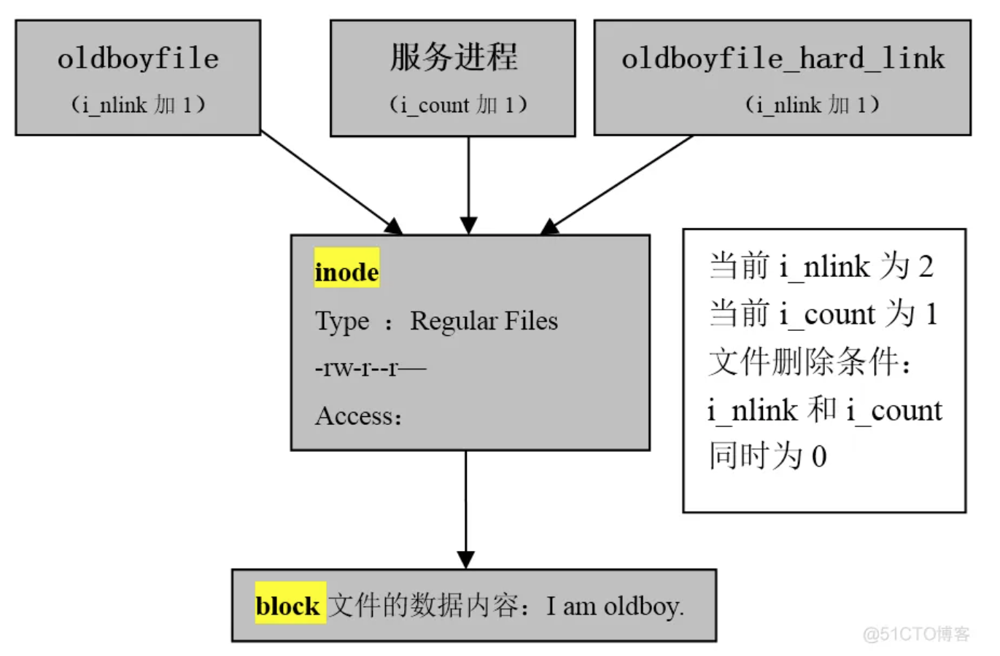

# 1.Linux操作系统如何优化

```shell
①不使用root登录，通过sudo授权，使用普通用户登录
②禁用不必要的进程和服务，减少系统负担
③配置yum源，从国内更新下载rpm包
④关闭selinux以及iptables
⑤Linux内核参数优化，sysctl -a 查询出最优内核参数，修改进程能打开的文件句柄数的数量，max-file表示系统级别的，ulimit -n表示进程级别的，这些参数需要写入/etc/sysctl.conf的文件中，执行sysctl -p执行
⑥磁盘方面，删除一些服务更新残留，采用raid磁盘阵列增大磁盘的使用效率
⑦cpu方面，为进程设置资源限制，使用Linux cgroups 来设置进程的CPU使用上限
⑧内存方面，尽量不设置swap分区，如果物理内存使用完了系统会跑的很慢但仍然可以运行，但swap用完了系统会发生错误
```

# 2.CentOS与Ubuntu有什么区别呢?

```shell
Ubuntu更新周期快速，频繁

1.软件包管理系统(重要区别)。
CentOS使用的是redhat的rpm格式和yum管理工具。Ubuntu使用Debian的.deb格式进行管理。

2.Centos非root用户没有sudo权限，如果需要使用sudo权限必须在/etc/sudoers 中加入账户和权限。
在Ubuntu中，一般使用sudo+命令。

3.在线安装软件中，centos使用的是yum命令，而ubuntu中使用的是apt-get命令。

4.防火墙不同
UbuntuD默认使用UFW防火墙，Centos使用的是iptables或者firewalld防火墙。
```

# 3.centos6和centos7的区别

```shell
1、内核版本：CentOS 6使用的是2.6.x内核，而CentOS 7使用的是3.x内核，新内核带来了更好的性能和更多的功能。 

2、系统架构：CentOS 6只支持32位和64位两种架构，而CentOS 7还支持ARM架构。 

3、系统服务管理：CentOS 6使用的是service命令管理系统服务，而CentOS 7使用的是systemctl命令，更加方便和灵活。 

4、文件系统：CentOS 6默认使用的是ext4文件系统，而CentOS 7默认使用的是XFS文件系统，XFS支持更大的文件和更快的速度。 

5、防火墙：CentOS 6使用的是iptables防火墙，而CentOS 7使用的是firewalld防火墙，firewalld更加灵活和易于管理。

6、软件包管理：CentOS 6使用的是yum软件包管理器，而CentOS 7使用的是dnf软件包管理器，dnf更加快速和稳定。
```

# 4.GO 和 Python 有什么区别？

```shell
1、Python是一种动态类型的语言。 GO是静态类型的语言。

2、两种语言的用途。 Python主要专注于Web开发和基于Linux的应用程序管理。Golang是一种系统语言，开发操作系统的语言，GO也可以并且也用于Web开发需求。

3、GO和Python之间非常重要的区别是面向对象。 Python从头到脚都是面向对象的。 但是，GO不是。 GO是强类型的，并且对面向对象的支持非常平庸。
```

# 5.linux操作系统有哪些发行版本？

```shell
Red Hat Linux
Red Hat 国内使用人群最多的 Linux 版本，资料丰富。
```


```shell
Ubuntu Linux
 Debian Linux 可视化页面，容易上手，对硬件的支持非常全面，适合做桌面系统的 Linux 发行版本，免费。
```


```shell
SuSE Linux
SuSE Linux 在欧洲较为流行。
SuSE Linux 与 Windows 的交互
```


# 6.linux软链接和硬链接有什么区别？

```
答分类：在Linux系统中，链接分两种 ：一种被称为硬链接（Hard Link），另一种被称为符号链接或软链接（Symbolic Link）。

答概念：硬链接文件与源文件的Inode节点号相同，而软链接文件相当于Windows下面的快捷方式（Inode节点号与源文件不同）

答创建：默认不带参数情况下，ln命令创建的是硬链接，带-s参数的ln命令创建的是软链接，创建命令示例。。

答特点：
a)不能对目录创建硬链接，但可以创建软链接，对目录的软链接会经常被用到。
b)软链接可以跨文件系统，硬链接不可以跨文件系统。
c)删除软链接文件,对源文件及硬链接文件无任何影响。
d)删除文件的硬链接文件，对源文件及软链接文件无任何影响。
e)删除链接文件的源文件，对硬链接文件无影响，会导致其软链接失效（红底白字闪烁状）。
f)同时删除源文件及其硬链接文件，整个文件才会被"真正"的删除。

答案例：硬链接用处不多，可以用来对重要文件做快照防止误删，对目录建立软链接在工作中很常用，例如：安装软件会用nginx-1.10作为目录，安装完后设置软链接为nginx，即保持了版本号标识，又方便使用，以及后续软件升级。
```

# 7.cpu负载与cpu利用率有什么区别？

```
CPU利用率：程序在运行某一时间段所占用CPU百分比。
CPU负载：某段时间正在使用和等待使用CPU的平均任务数。
```

# 8.fdisk和gdisk分区的区别？

```
gdisk：划分磁盘GPT格式，硬盘容量＞2T
fdisk：划分磁盘MBR格式。硬盘容量<2T
```

# 9.Centos7的启动流程是什么？




# 10.Linux 常用的网络排查指令有哪些？

```shell
1.ss -tanlp都可以；
2.netstat  -tnlp，有些也可以补充，-u是udp协议，-t是tcp协议；
3.ping  ip地址，也可以确定通不通的一个手段，
4.tranceroute ip地址 ，排查地址经过的路径，
5.抓包，tcpdump命令抓包，tcpdump -nn -i eth0抓包eth0网卡的包
```

# 11.netstat -tcip参数什么意思？

```shell
-t 选项表示只显示 TCP 连接的信息；
-c 选项表示每隔一段时间重新显示一次当前所有连接的状态；
-l 选项表示只显示监听状态的连接；
-p 选项表示显示每个连接对应的进程 ID 和进程名。
```

# 12.看磁盘的IO用什么命令？

```shell
使用 iostat 命令来查看磁盘的 I/O 状况，包括磁盘读写的速度、I/O 的等待时间、I/O 请求队列的长度
```

# 13.crontab日志路径在哪儿？

```shell
/var/spool/cron/
```

# 14.Linux系统文件删除原理

1.静态文件
：i_link=0，解释硬链接数为0，所有的硬链接都删除文件就被删除了。
2.动态文件
i_count=0, 进程引用计数为0，没有被进程调用（使用）的文件。

3.原理见图



