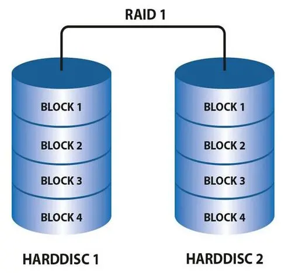

# Linux操作系统如何优化

```shell
①不使用root登录，通过sudo授权，使用普通用户登录
②禁用不必要的进程和服务，减少系统负担
③配置yum源，从国内更新下载rpm包
④关闭selinux以及iptables
⑤Linux内核参数优化，sysctl -a 查询出最优内核参数，修改进程能打开的文件句柄数的数量，max-file表示系统级别的，ulimit -n表示进程级别的，这些参数需要写入/etc/sysctl.conf的文件中，执行sysctl -p执行
⑥磁盘方面，删除一些服务更新残留，采用raid磁盘阵列增大磁盘的使用效率
⑦cpu方面，为进程设置资源限制，使用Linux cgroups 来设置进程的CPU使用上限
⑧内存方面，尽量不设置swap分区，如果物理内存使用完了系统会跑的很慢但仍然可以运行，但swap用完了系统会发生错误
```

# CentOS与Ubuntu有什么区别呢?

```shell
Ubuntu更新周期快速，频繁

1.软件包管理系统(重要区别)。
CentOS使用的是redhat的rpm格式和yum管理工具。Ubuntu使用Debian的.deb格式进行管理。

2.Centos非root用户没有sudo权限，如果需要使用sudo权限必须在/etc/sudoers 中加入账户和权限。
在Ubuntu中，一般使用sudo+命令。

3.在线安装软件中，centos使用的是yum命令，而ubuntu中使用的是apt-get命令。

4.防火墙不同
UbuntuD默认使用UFW防火墙，Centos使用的是iptables或者firewalld防火墙。
```

# centos6和centos7的区别

```shell
1、内核版本：CentOS 6使用的是2.6.x内核，而CentOS 7使用的是3.x内核，新内核带来了更好的性能和更多的功能。 

2、系统架构：CentOS 6只支持32位和64位两种架构，而CentOS 7还支持ARM架构。 

3、系统服务管理：CentOS 6使用的是service命令管理系统服务，而CentOS 7使用的是systemctl命令，更加方便和灵活。 

4、文件系统：CentOS 6默认使用的是ext4文件系统，而CentOS 7默认使用的是XFS文件系统，XFS支持更大的文件和更快的速度。 

5、防火墙：CentOS 6使用的是iptables防火墙，而CentOS 7使用的是firewalld防火墙，firewalld更加灵活和易于管理。

6、软件包管理：CentOS 6使用的是yum软件包管理器，而CentOS 7使用的是dnf软件包管理器，dnf更加快速和稳定。
```

# GO 和 Python 有什么区别？

```shell
1、Python是一种动态类型的语言。 GO是静态类型的语言。

2、两种语言的用途。 Python主要专注于Web开发和基于Linux的应用程序管理。Golang是一种系统语言，开发操作系统的语言，GO也可以并且也用于Web开发需求。

3、GO和Python之间非常重要的区别是面向对象。 Python从头到脚都是面向对象的。 但是，GO不是。 GO是强类型的，并且对面向对象的支持非常平庸。
```

# linux操作系统有哪些发行版本？

```shell
Red Hat Linux
Red Hat 国内使用人群最多的 Linux 版本，资料丰富。
```


```shell
Ubuntu Linux
 Debian Linux 可视化页面，容易上手，对硬件的支持非常全面，适合做桌面系统的 Linux 发行版本，免费。
```


```shell
SuSE Linux
SuSE Linux 在欧洲较为流行。
SuSE Linux 与 Windows 的交互
```


# 磁盘阵列raid是什么？

```shell
raid是什么？
RAID （ Redundant Array of Independent Disks ）即独立磁盘冗余阵列，简称为「磁盘阵列」，多个独立的磁盘拼在一起组成一个大的磁盘系统，比单块磁盘更好的存储性能和更高的可靠性。
```

```shell
raid0
raid1
raid5
raid6
raid10
```

```shell
raid0
RAID0 将多块磁盘拼在一起组成一个大的存储空间。
当写数据时，会将数据分为N份，在N块磁盘进行读写，N份数据同时写到磁盘中，性能高。
缺：不提供数据校验或冗余备份，要是磁盘坏了，数据就丢失了，无法恢复。
所以，RAID0不用于高要求业务，可用在可靠性要求不高，读写性能要求高的场景。
```


```shell
raid1
RAID1 成本高。同时写双份无差别数据到工作盘和镜像盘，奢侈！
可靠性强，性能较弱。
```



```shell
raid5
将性能、安全、成本都兼顾。
RAID5把校验码信息分布到各个磁盘上。
RAID5最少需要三块磁盘来组建磁盘阵列，允许最多同时坏一块磁盘。要是两块磁盘坏了，数据无法恢复。
```


```shell
raid6
两块磁盘同时损坏的情况下，也能保障数据可恢复。
复杂度高，虽然数据冗余性好，读取效率比较高，但写数据性能差。
```

```shell
raid10
兼顾raid1和raid0优点
RAID1同时写双份无差别数据到工作盘和镜像盘起到了数据保障的作用。且在每一份磁盘上又会使用RAID0的技术将数据分为N份，在N块磁盘进行读写，N份数据同时写到磁盘中，性能高。

RAID10有一半的磁盘空间用于存储冗余数据的，浪费的很严重。
```


# linux软链接和硬链接有什么区别？

```
1、软链接可以把路径存放至文件，硬链接是文件副本。
2、软链接可跨不同文件系统而链接，硬链接不行。
3、软链接可对目录链接，硬链接不行。
4、软链接可对不存在的文件名进行链接，硬链接必须要有源文件。
5、删除软链接的源文件，软链接失效。但硬链接可用。
```

# cpu平均负载与cpu利用率有什么区别？

```shell
cpu利用率反映的是当前cpu的繁忙程度，忽高忽低的原因在于占用cpu处理时间的进程可能处于io等待状态但却还未释放进入wait。 
平均负载（load average）是指某段时间内占用cpu时间的进程和等待cpu时间的进程数，这里等待cpu时间的进程是指等待被唤醒的进程，不包括处于wait状态进程。
```

```http
5月3日23:00整理至此
```

```

```

```

```

# fdisk和gdisk分区的区别？

```shell
gdisk：默认将磁盘划分为GPT格式的分区，主要用来划分容量＞2T的硬盘fdisk：默认将磁盘划分为MBR格式的分区，主要用来划分容量<2T的硬盘
```

