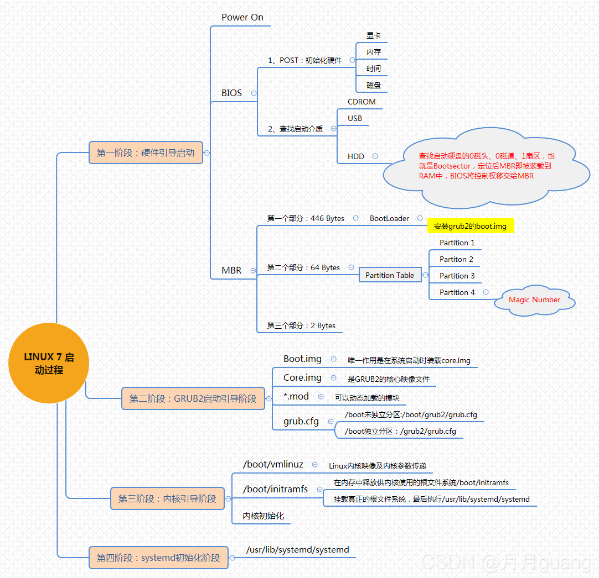
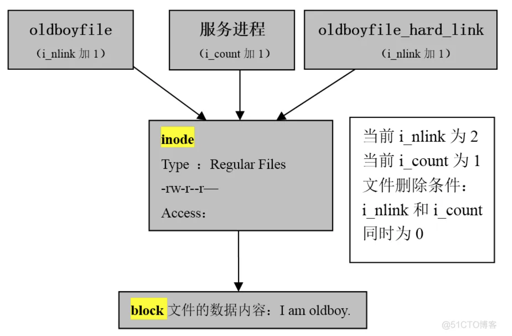

### 1.Linux操作系统如何优化

```shell
①不使用root登录，通过sudo授权，使用普通用户登录
②禁用不必要的进程和服务，减少系统负担
③配置yum源，从国内更新下载rpm包
④关闭selinux以及iptables
⑤Linux内核参数优化，sysctl -a 查询出最优内核参数，修改进程能打开的文件句柄数的数量，max-file表示系统级别的，ulimit -n表示进程级别的，这些参数需要写入/etc/sysctl.conf的文件中，执行sysctl -p执行
⑥磁盘方面，删除一些服务更新残留，采用raid磁盘阵列增大磁盘的使用效率
⑦cpu方面，为进程设置资源限制，使用Linux cgroups 来设置进程的CPU使用上限
⑧内存方面，尽量不设置swap分区，如果物理内存使用完了系统会跑的很慢但仍然可以运行，但swap用完了系统会发生错误
```

### 2.CentOS与Ubuntu有什么区别呢?

```shell
Ubuntu更新周期快速，频繁

1.软件包管理系统(重要区别)。
CentOS使用的是redhat的rpm格式和yum管理工具。Ubuntu使用Debian的.deb格式进行管理。

2.Centos非root用户没有sudo权限，如果需要使用sudo权限必须在/etc/sudoers 中加入账户和权限。
在Ubuntu中，一般使用sudo+命令。

3.在线安装软件中，centos使用的是yum命令，而ubuntu中使用的是apt-get命令。

4.防火墙不同
UbuntuD默认使用UFW防火墙，Centos使用的是iptables或者firewalld防火墙。
```

### 3.centos6和centos7的区别

```shell
1、内核版本：CentOS 6使用的是2.6.x内核，而CentOS 7使用的是3.x内核，新内核带来了更好的性能和更多的功能。 

2、系统架构：CentOS 6只支持32位和64位两种架构，而CentOS 7还支持ARM架构。 

3、系统服务管理：CentOS 6使用的是service命令管理系统服务，而CentOS 7使用的是systemctl命令，更加方便和灵活。 

4、文件系统：CentOS 6默认使用的是ext4文件系统，而CentOS 7默认使用的是XFS文件系统，XFS支持更大的文件和更快的速度。 

5、防火墙：CentOS 6使用的是iptables防火墙，而CentOS 7使用的是firewalld防火墙，firewalld更加灵活和易于管理。

6、软件包管理：CentOS 6使用的是yum软件包管理器，而CentOS 7使用的是dnf软件包管理器，dnf更加快速和稳定。
```

### 4.GO 和 Python 有什么区别？

```shell
1、Python是一种动态类型的语言。 GO是静态类型的语言。

2、两种语言的用途。 Python主要专注于Web开发和基于Linux的应用程序管理。Golang是一种系统语言，开发操作系统的语言，GO也可以并且也用于Web开发需求。

3、GO和Python之间非常重要的区别是面向对象。 Python从头到脚都是面向对象的。 但是，GO不是。 GO是强类型的，并且对面向对象的支持非常平庸。
```

### 5.linux操作系统有哪些发行版本？

```shell
Red Hat Linux
Red Hat 国内使用人群最多的 Linux 版本，资料丰富。
```


```shell
Ubuntu Linux
 Debian Linux 可视化页面，容易上手，对硬件的支持非常全面，适合做桌面系统的 Linux 发行版本，免费。
```


```shell
SuSE Linux
SuSE Linux 在欧洲较为流行。
SuSE Linux 与 Windows 的交互
```


### 6.linux软链接和硬链接有什么区别？

```
1、ln命令创建硬链接，ln -s命令创建软链接
2、目录不能创建硬链接，并且硬链接不可以跨越分区系统；
3、软链接支持对目录创建，同时也支持跨越分区系统；
4、硬链接文件与源文件的inode相同，软链接文件与源文件inode不同；
5、删除软链接文件，对源文件及硬链接文件无任何影响；
6、删除文件的硬链接文件，对源文件及链接文件无任何影响；
7、删除链接文件的源文件，对硬链接无影响，会导致软链接失效；
8、删除源文件及其硬链接文件，整个文件会被真正的删除；
```

### 7.cpu负载与cpu利用率有什么区别？

```
CPU利用率：程序在运行某一时间段所占用CPU百分比。
CPU负载：某段时间正在使用和等待使用CPU的平均任务数。
```

### 8.fdisk和gdisk分区的区别？

```
gdisk：划分磁盘GPT格式，硬盘容量＞2T
fdisk：划分磁盘MBR格式。硬盘容量<2T
```

### 9.Centos7的启动流程是什么？




### 10.Linux 常用的网络排查指令有哪些？

```shell
1.ss -tanlp都可以；
2.netstat  -tnlp，有些也可以补充，-u是udp协议，-t是tcp协议；
3.ping  ip地址，也可以确定通不通的一个手段，
4.tranceroute ip地址 ，排查地址经过的路径，
5.抓包，tcpdump命令抓包，tcpdump -nn -i eth0抓包eth0网卡的包
```

### 11.netstat -tcip参数什么意思？

```shell
-t 选项表示只显示 TCP 连接的信息；
-c 选项表示每隔一段时间重新显示一次当前所有连接的状态；
-l 选项表示只显示监听状态的连接；
-p 选项表示显示每个连接对应的进程 ID 和进程名。
```

### 12.看磁盘的IO用什么命令？

```shell
使用 iostat 命令来查看磁盘的 I/O 状况，包括磁盘读写的速度、I/O 的等待时间、I/O 请求队列的长度
```

### 13.Linux系统文件删除原理

1.静态文件
：i_link=0，解释硬链接数为0，所有的硬链接都删除文件就被删除了。
2.动态文件
i_count=0, 进程引用计数为0，没有被进程调用（使用）的文件。

3.原理见图



### 14.Linux启动过程原理CentOS6,centOS7,centOs,Ubuntu

Linux系统的启动过程可以分为以下几个阶段：

##### 1.BIOS/UEFI阶段

```
在计算机开机后，首先由计算机的BIOS或UEFI引导程序加载操作系统。BIOS/UEFI会检查计算机硬件设备的状态，并选择一个可启动的设备，例如硬盘或USB驱动器。如果选择的设备上存在引导扇区（boot sector），则会将其加载到内存中，并跳转到该扇区的代码开始执行。
```

##### 2.Boot Loader阶段

```
引导扇区通常包含引导加载程序（boot loader），例如GRUB（GRand Unified Bootloader）。引导加载程序负责加载操作系统的内核和初始化 RAM 磁盘映像（initramfs），并将控制权传递给内核。在这个阶段，操作系统的内核和一些必要的驱动程序被加载到内存中。
在CentOS6及之前的版本中，使用的是GRUB Legacy作为引导加载程序，而在CentOS7及之后的版本中，使用的是GRUB2作为引导加载程序。
```

##### 3.内核初始化阶段

```
在内核初始化阶段，内核会对硬件进行初始化，例如检测和识别硬件设备、加载驱动程序等。这个阶段的主要任务是为操作系统的正常运行准备好硬件环境。
```

##### 4.系统初始化阶段

```
在内核初始化完成后，操作系统会进入系统初始化阶段。在这个阶段，系统会根据配置文件和脚本文件进行一系列初始化操作，例如挂载文件系统、启动服务、加载驱动程序等。这个阶段的主要任务是为系统的正常运行准备好环境。
在CentOS和Ubuntu中，系统初始化阶段使用的启动脚本不同。在CentOS中，使用的是SysV init系统；而在Ubuntu中，则使用的是Upstart或systemd系统。
```

##### 5.用户登录阶段

```
在系统初始化阶段完成后，操作系统会启动登录管理器（login manager）或显示登录提示符（login prompt）。用户可以输入用户名和密码进行登录，进入系统后即可开始使用各种应用程序和服务。
Linux系统的启动过程涉及多个阶段，每个阶段都有不同的任务和流程。了解每个阶段的核心流程和原理，可以帮助我们更好地理解和管理Linux系统。下面是CentOS6、CentOS7、CentOS8和Ubuntu的启动过程简要介绍：
```

##### CentOS6启动过程

```
1.BIOS/UEFI阶段
2.Boot Loader阶段（使用GRUB Legacy）
3.内核初始化阶段
4.系统初始化阶段（使用SysV init系统）
5.用户登录阶段
```

##### CentOS7启动过程

```
1.BIOS/UEFI阶段
2.Boot Loader阶段（使用GRUB2）
3.内核初始化阶段
4.系统初始化阶段（使用systemd系统）
5.用户登录阶段
```

##### CentOS8启动过程

```
1.BIOS/UEFI阶段
2.Boot Loader阶段（使用GRUB2）
3.内核初始化阶段
4.系统初始化阶段（使用systemd系统）
5.用户登录阶段
```

##### Ubuntu启动过程

```
1.BIOS/UEFI阶段
2.Boot Loader阶段（使用GRUB2）
3.内核初始化阶段
4.系统初始化阶段（使用Upstart或systemd系统）
5.用户登录阶段
```

### 15.grep/egrep、sed、awk笔试

##### 1. 选择

1.在给定文件中查找与条件相符字符串的命令及查找某个目录下相应文件的命令为：（多选）(AC)

- A:grep
- B:gzip
- C:find
- D:sort

2.在给定文件中查找与设定条件相符字符串的命令为（A）

- A：grep
- B：gzip
- C：find
- D：sort

3.__D__命令可以从文本文件的每一行中截取指定内容的数据。

- A：cp
- B：dd
- C：fmt
- D：cut

4.下面表述错误的是(D)

- A.表示开头，如^abc表示以abc开头的
- B. $表示结尾如abc$表示以abc为结尾的
- C.？表示前一个字符出现0或1次，如ab？c表示a与c之间可有0或1个b存在
- D.+ 表示前一个字符出现0或多次。如ab+c表示a与c之间可有0或多个b存在

##### 2. 填空

1.Unix中在当前目录下所有.cc 的文件中找到含有“asiainfo”内容的文件，命令为

```bash
find  . -type f -name "*.cc" | xargs grep  'asiainfo'
find . -type f -name "*.cc" -exec grep "asiainfo" {} \;
grep "asiainfo" `find . -type f -name "*.cc"`1.2.3.
```

2.使用AWK指定分隔符的参数是_______-F _,-vFS=

```bash
awk 'BEGIN{FS=":"}{print $1,$3}' /etc/passwd1.
```

##### 3. 简答

1.找出当前目录下包含127.0.0.1关键字的文件？

```bash
方法1
grep "127.0.0.1" ` find -type f `
sed -n '/127.0.0.1/p' `  find -type f`
awk '/127.0.0.1/' `  find -type f`
方法2
find -type f | xargs grep "127.0.0.1"
find -type f | xargs sed -n '/127.0.0.1/p'
find -type f | xargs awk '/127.0.0.1/'
方法3
find -type f -exec grep "127.0.0.1" {} \
find -type f -exec sed -n '/127.0.0.1/p'  {} \
find -type f -exec awk '/127.0.0.1/' {} \1.2.3.4.5.6.7.8.9.10.11.12.
```

2.删除/显示1.txt文件第3行到第10行的内容？

```bash
sed -n '3,10p' 1.txt
awk '3<=NR1 && $01  && $0<255'1.2.
```

3.文件内容排序、文件行取唯一值的命令分别是？

```bash
sort
uniq1.2.
```

4.用awk获取文件中第三行的倒数第二列字段

```bash
awk 'NR==3{print $(NR-1)}' file.txt1.
```

5.awk是一个很强大的文本处理工具，请使用awk统计当前主机的并发访问量

```bash
netstat -ant|awk '/^tcp/{stat[$NF]++}END{for( k in stat) print k,stat[k]}'
ss -ant | '{stat[$NF]++}END{for( k in stat) print k,stat[k]}'1.2.
```

6.有一个文件nginx.log，请用awk提取时间（HH:MM）,文件内容如下：

```bash
183.250.220.178|-l[20/jul/2017:10:35:14 +0800]|POST /audiosearch/search
HTTP/1.1|200|54|-lDalvik/1.6.0（linux;U;Android 4,4,4;Konka Android TV 638
Build/KTU84P）|-l-[5.069|5.001,0.005|www.kuyun.com|8771|172.21.19.67:8084,172.21.19.66:8084]
183.250.220.178|-l[20/jul/2017:10:35:14 +0800]|POST /audiosearch/search
HTTP/1.1|200|54|-lDalvik/1.6.0（linux;U;Android 4,4,4;Konka Android TV 638
Build/KTU84P）|-l-[5.069|5.001,0.005|www.kuyun.com|8771|172.21.19.67:8084,172.21.19.66:8084]1.2.3.4.5.6.
awk -F "2017:|:14" '{print $2}' nginx.txt
awk -F "....:|:.." '{print $2}' nginx.txt1.2.
```

7.从a.log文件中提取包含“WARNING”或“FATAL”，同时不包含“IGNOR”行，然后，提取以“：”分割的第五个字段

```bash
awk -F : '/WARING|FATAL/ &&!/IGNOR/{print $5}'1.
```

##### 4.老牛逼题目

1.统计apache访问日志流量排名前10个IP

```bash
awk '{IP[$1]+=$10}END{for (k in IP) print k,IP[K]}' access.log| sort -nrk2| head -101.
```

2.统计出apache的access.log 中访问最多的5个ip

```bash
awk '{IP[$1]++}END{for (k in IP) print k,IP[K]}' access.log| sort -nrk2| head -51.
```

3.这条linux命令的含义：netstat -n |awk '/^tcp/ {++h{$NF}} END {for{a in h } print a,h[a] }'

```bash
tcp 状态 每种状态的数量。1.
```

4.使用awk分析日志（最后一个字段是IP，统计访问量前十的IP，并进行排序）

登录后复制 

```bash
awk '{IP[$NF]++}END{for (k in IP) print k,IP[K]}' access.log | sort -nrk2 | head 


awk '{h[$NF]++}END{for(p in h)print p,h[p]}' access.log |sort -rnk2|head 
awk '{print $NF}' access.log|sort |uniq -c|sort -rnk2|head
```

### 16.什么是Bash shell

Bash shell是命令解释器，负责用户的应用程序与内核进行交互的一种接口，将用户输入的命令翻译给Kernel，有Kernel驱动硬件，最后将处理的结果返回给Bash shell终端


### 17.Bash shell能干什么

> 1、文件管理
>
> 2、权限管理
>
> 3、用户管理
>
> 4、磁盘管理
>
> 5、网络管理
>
> 6、软件管理
>
> 7、服务管理

### 18.说一说Linux的目录结构

`命令相关的目录bin`

> 普通用户使用的命令/bin 
>
> 管理员使用的命令/sbin 

`用户家相关的目录`/home

> 普通用户的家目录/home
>
> 超级管理员root的家目录/root 

`系统文件目录/usr`

> /usr相当于C:\Windows
>
> /usr/local软件安装的目录，相当于C:\Program
>
> /usr/bin/普通用户使用的应用程序
>
> /usr/sbin管理员使用的应用程序
>
> /usr/lib库文件
>
> /usr/lib64库文件

`系统启动目录/boot`

> 存放系统启动时kernel内核与grub引导菜单
>
> /boot存放的系统启动相关的文件，比如：kernel，grub(引导装载程序)

`配置文件目录/etc`

/etc存放系统配置文件目录，后续所有服务的配置都在这个目录中

`设备相关目录/dev`

> /dev存放设备文件的目录，比如硬盘，硬盘分区
>
> /dev/null黑洞设备，只进不出

`可变的目录/var`

> /var，存放一些变化文件，比如/var/log/下的日志文件

### 19.文件是如何被读取的？


### 20.什么是软连接

软连接相当于windows的快捷方式，软连接文件会将inode指向源文件的block。当我们访问这个软链接文件时，其实访问的是源文件本身


使用场景

> 软件升级
>
> 代码发布

### 21.硬链接

不同的文件名指向同一个inode，就是指向同一个真实的数据源


### 22.说一下Inode与Block？

文件有文件名与数据，在Linux上被分成两个部分:数据data与文件元数据 metadata

> 1.数据 data block，数据块是用来记录文件真实内容的地方，我们将其称为B1ock
>
> 2.元数据 metadata，用来记录文件大小、创建时间、所有者等信息，我们将其称为Inode
>
> 3.需要注意:Inode并不包含文件名称，inode仅包含文件的元数据信息，具体来说有以
>
> 下内容：

```bash
文件的字节数
文件的User ID Group lD
文件的读、写、执行权限
文件的时间戳
链接数，即有多少文件名指向这个inode
文件数据block的位置
```

每个inode 都是一个编号，操作系统是通过Inode来识别不同的文件。

> 对于系统来说，文件名只是inode便于识别的别名，或者绰号。(便于我们人识别)
>
> 表面上，用户是通过文件名打开的文件，实际上系统内部这个过程分为如下三步

> 1、首先，系统找到这个文件名对应的inode编号
>
> 2、其次，通过inode编号，获取inode信息
>
> 3、最后，根据inode信息，找到文件数据所在的block，读出数据。


