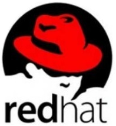

### Linux操作系统如何优化

```shell
①不使用root登录，通过sudo授权，使用普通用户登录
②禁用不必要的进程和服务，减少系统负担
③配置yum源，从国内更新下载rpm包
④关闭selinux以及iptables
⑤磁盘方面，删除一些服务更新残留，采用raid磁盘阵列增大磁盘的使用效率
⑥内存方面，尽量不设置swap分区，如果物理内存使用完了系统会跑的很慢但仍然可以运行，但swap用完了系统会发生错误
```

### CentOS与Ubuntu有什么区别呢?

```shell
Ubuntu更新周期快速，频繁

1.软件包管理系统(重要区别)。
CentOS使用的是redhat的rpm格式和yum管理工具。Ubuntu使用Debian的.deb格式进行管理。

2.Centos非root用户没有sudo权限，如果需要使用sudo权限必须在/etc/sudoers中加入账户和权限。
在Ubuntu中，一般使用sudo+命令。

3.在线安装软件中，centos使用的是yum命令，而ubuntu中使用的是apt-get命令。

4.防火墙不同
UbuntuD默认使用UFW防火墙，Centos使用的是iptables或者firewalld防火墙。
```

### centos6和centos7的区别

```shell
1、内核版本：CentOS 6使用的是2.6.x内核，而CentOS 7使用的是3.x内核，新内核带来了更好的性能和更多的功能。 

2、系统架构：CentOS 6只支持32位和64位两种架构，而CentOS 7还支持ARM架构。 

3、系统服务管理：CentOS 6使用的是service命令管理系统服务，而CentOS 7使用的是systemctl命令，更加方便和灵活。 

4、文件系统：CentOS 6默认使用的是ext4文件系统，而CentOS 7默认使用的是XFS文件系统，XFS支持更大的文件和更快的速度。 

5、防火墙：CentOS 6使用的是iptables防火墙，而CentOS 7使用的是firewalld防火墙，firewalld更加灵活和易于管理。

6、软件包管理：CentOS 6使用的是yum软件包管理器，而CentOS 7使用的是dnf软件包管理器，dnf更加快速和稳定。
```

### GO 和 Python 有什么区别？

```shell
1、Python是一种动态类型的语言。 GO是静态类型的语言。

2、两种语言的用途。 Python主要专注于Web开发和基于Linux的应用程序管理。Golang是一种系统语言，开发操作系统的语言，GO也可以并且也用于Web开发需求。

3、GO和Python之间非常重要的区别是面向对象。 Python从头到脚都是面向对象的。 但是，GO不是。GO是强类型的，并且对面向对象的支持非常平庸。
```

### linux操作系统有哪些发行版本？各自哪些区别？

```shell
Red Hat Linux
Red Hat 国内使用人群最多的 Linux 版本，资料丰富。
```



```shell
Ubuntu Linux
Debian Linux 可视化页面，容易上手，对硬件的支持非常全面，适合做桌面系统的 Linux 发行版本，免费。
```


```shell
SuSE Linux
SuSE Linux 在欧洲较为流行。
SuSE Linux 与 Windows 的交互
```


```shell
1.Ubuntu：用户友好，适合桌面和服务器使用，有长期支持 (LTS) 版本。

2.CentOS：基于 Red Hat Enterprise Linux (RHEL)，稳定性高，适合服务器和企业应用。

3.Debian：稳定性和安全性高，拥有强大的软件包管理系统，适合服务器和桌面使用。

4.Fedora：采用最新的开源技术，是 Red Hat 的社区发行版，适合开发者和技术爱好者。

5.openSUSE：注重易用性和稳定性，拥有 YaST 工具进行系统配置，适合企业和个人用户。

6.Arch Linux：面向高级用户，提供最小化的基础系统，可以自定义构建自己的系统。

7.Linux Mint：注重用户友好性和易用性，提供了各种桌面环境的版本。

8.Kali Linux：专为渗透测试和网络安全而设计，内置了大量安全工具。

9.Elementary OS：注重美观和用户体验，类似于 macOS 风格的桌面操作系统。

10.Slackware：是 Linux 发行版中最早的发行版之一，简单且稳定，适合高级用户和爱好者。
```

### linux软链接和硬链接有什么区别？

```
1、ln命令创建硬链接，ln -s命令创建软链接
2、目录不能创建硬链接，并且硬链接不可以跨越分区系统；
3、软链接支持对目录创建，同时也支持跨越分区系统；
4、硬链接文件与源文件的inode相同，软链接文件与源文件inode不同；
5、删除软链接文件，对源文件及硬链接文件无任何影响；
6、删除文件的硬链接文件，对源文件及链接文件无任何影响；
7、删除链接文件的源文件，对硬链接无影响，会导致软链接失效；
8、删除源文件及其硬链接文件，整个文件会被真正的删除；
```

### cpu负载与cpu利用率有什么区别？

```
CPU 负载是指系统中正在等待执行的进程数量，通常以负载平均值（load average）的形式表示。负载平均值是一段时间内系统的平均负载情况，它反映了系统处理器的繁忙程度。例如，负载平均值为 1 表示系统中有一个正在运行的进程，负载平均值为 2 表示系统中有两个正在运行的进程，以此类推。

CPU 利用率是指 CPU 在一段时间内实际执行工作的时间与该时间段总时间的比率。它表示了 CPU 的使用率或繁忙程度。通常以百分比的形式表示，例如，CPU 利用率为 50% 表示 CPU 在这段时间内有一半的时间用于执行工作，另一半的时间处于空闲状态。

简而言之，CPU 负载反映了系统中等待执行的进程数量，而 CPU 利用率反映了 CPU 实际执行工作的情况
```

### fdisk和gdisk分区的区别？

```
gdisk：划分磁盘GPT格式，硬盘容量＞2T
fdisk：划分磁盘MBR格式。硬盘容量<2T

fdisk 是传统的磁盘分区工具，适用于使用 MBR（Master Boot Record）分区表的系统。它在 Linux 和其他类 Unix 系统上广泛使用。

gdisk 是用于 GUID Partition Table（GPT）分区表的工具，适用于较新的 UEFI（Unified Extensible Firmware Interface）系统。GPT 提供了比 MBR 更先进的磁盘分区方案，支持更大的磁盘容量和更多的分区。
```

### Centos7的启动流程是什么？


### Linux 常用的网络排查指令有哪些？

```shell
1.ping：用于测试主机之间的连通性，发送 ICMP 报文并等待响应。

2.traceroute 或 traceroute6：用于追踪数据包在网络上的路由路径，显示数据包从源到目的地的经过的路由器。

3.netstat：用于显示网络连接、路由表、接口统计信息等网络相关信息。

4.ss：用于查看套接字统计信息，显示当前网络连接状态和套接字信息。

5.ifconfig 或 ip addr：用于显示和配置网络接口的信息，包括 IP 地址、子网掩码、MAC 地址等。

6.arp：用于显示和操作系统的 ARP 缓存，查看和管理 IP 地址到 MAC 地址的映射关系。

7.dig 或 nslookup：用于查询 DNS 服务器，获取域名解析信息。

8.tcpdump 或 Wireshark：用于抓取和分析网络数据包，对网络通信进行详细的分析和监控。
```

### netstat -tnulp参数什么意思？

```shell
-t:选项表示只显示 TCP 连接的信息；
-n: 使用数字形式显示地址和端口号，而不是尝试进行 DNS 查询以获取主机名
-u: 显示 UDP 协议相关的连接信息
-l: 仅显示在监听状态下的连接
-p: 显示与每个连接相关联的进程的 PID 和进程名称
```

### 看磁盘的IO用什么命令？

```shell
1.iostat：显示磁盘和 CPU 使用情况的统计信息，包括每个磁盘的读写速率、平均等待时间等。

2.iotop：类似于 top 命令，但是显示磁盘 I/O 使用情况，可以实时查看哪些进程正在进行磁盘 I/O 操作。

3.atop：类似于 top 命令，但提供了更详细的系统资源使用情况，包括磁盘 I/O 情况。

4.sar：系统性能监控工具，可以生成系统活动报告，包括磁盘 I/O、CPU 使用率等信息。
```

### Linux启动过程原理CentOS6,centOS7,Ubuntu

Linux系统的启动过程可以分为以下几个阶段：

##### 1.BIOS/UEFI阶段

```
在计算机开机后，首先由计算机的BIOS或UEFI引导程序加载操作系统。BIOS/UEFI会检查计算机硬件设备的状态，并选择一个可启动的设备，例如硬盘或USB驱动器。如果选择的设备上存在引导扇区（boot sector），则会将其加载到内存中，并跳转到该扇区的代码开始执行。
```

##### 2.Boot Loader阶段

```
引导扇区通常包含引导加载程序（boot loader），例如GRUB（GRand Unified Bootloader）。引导加载程序负责加载操作系统的内核和初始化 RAM 磁盘映像（initramfs），并将控制权传递给内核。在这个阶段，操作系统的内核和一些必要的驱动程序被加载到内存中。
在CentOS6及之前的版本中，使用的是GRUB Legacy作为引导加载程序，而在CentOS7及之后的版本中，使用的是GRUB2作为引导加载程序。
```

##### 3.内核初始化阶段

```
在内核初始化阶段，内核会对硬件进行初始化，例如检测和识别硬件设备、加载驱动程序等。这个阶段的主要任务是为操作系统的正常运行准备好硬件环境。
```

##### 4.系统初始化阶段

```
在内核初始化完成后，操作系统会进入系统初始化阶段。在这个阶段，系统会根据配置文件和脚本文件进行一系列初始化操作，例如挂载文件系统、启动服务、加载驱动程序等。这个阶段的主要任务是为系统的正常运行准备好环境。
在CentOS和Ubuntu中，系统初始化阶段使用的启动脚本不同。在CentOS6中，使用的是SysV init系统；而在Ubuntu中，则使用的是Upstart或systemd系统。
```

##### 5.用户登录阶段

```
在系统初始化阶段完成后，操作系统会启动登录管理器（login manager）或显示登录提示符（login prompt）。用户可以输入用户名和密码进行登录，进入系统后即可开始使用各种应用程序和服务。
Linux系统的启动过程涉及多个阶段，每个阶段都有不同的任务和流程。了解每个阶段的核心流程和原理，可以帮助我们更好地理解和管理Linux系统。下面是CentOS6、CentOS7、CentOS8和Ubuntu的启动过程简要介绍：
```

##### CentOS6启动过程

```
1.BIOS/UEFI阶段
2.Boot Loader阶段（使用GRUB Legacy）
3.内核初始化阶段
4.系统初始化阶段（使用SysV init系统）
5.用户登录阶段
```

##### CentOS7启动过程

```
1.BIOS/UEFI阶段
2.Boot Loader阶段（使用GRUB2）
3.内核初始化阶段
4.系统初始化阶段（使用systemd系统）
5.用户登录阶段
```

##### CentOS8启动过程

```
1.BIOS/UEFI阶段
2.Boot Loader阶段（使用GRUB2）
3.内核初始化阶段
4.系统初始化阶段（使用systemd系统）
5.用户登录阶段
```

##### Ubuntu启动过程

```
1.BIOS/UEFI阶段
2.Boot Loader阶段（使用GRUB2）
3.内核初始化阶段
4.系统初始化阶段（使用Upstart或systemd系统）
5.用户登录阶段
```

### 什么是Bash shell

Bash shell是命令解释器，负责用户的应用程序与内核进行交互的一种接口，将用户输入的命令翻译给Kernel，有Kernel驱动硬件，最后将处理的结果返回给Bash shell终端


### Bash shell能干什么

```shell
1.执行系统命令：BashShell 可以执行系统命令，如文件操作、进程管理、系统配置等。

2.编写和执行脚本：BashShell 是一种脚本编程语言，可以编写脚本来自动化任务，如批量处理文件、定期备份数据等。

3.管道和重定向：BashShell 支持管道和重定向操作，可以将命令的输出传递给其他命令或文件，实现数据流的处理和管理。

4.环境变量和别名：BashShell 可以设置和管理环境变量和命令别名，用于配置用户的工作环境和自定义命令行行为。

5.控制流和循环结构：BashShell 支持条件语句、循环结构和函数定义，使得编写复杂的脚本更加灵活和高效。
```

> 1、文件管理
>
> 2、权限管理
>
> 3、用户管理
>
> 4、磁盘管理
>
> 5、网络管理
>
> 6、软件管理
>
> 7、服务管理

### 说一说Linux的目录结构

`命令相关的目录bin`

> 普通用户使用的命令/bin 
>
> 管理员使用的命令/sbin 

`用户家相关的目录`/home

> 普通用户的家目录/home
>
> 超级管理员root的家目录/root 

`系统文件目录/usr`

> /usr相当于C:\Windows
>
> /usr/local软件安装的目录，相当于C:\Program
>
> /usr/bin/普通用户使用的应用程序
>
> /usr/sbin管理员使用的应用程序
>
> /usr/lib库文件
>
> /usr/lib64库文件

`系统启动目录/boot`

> 存放系统启动时kernel内核与grub引导菜单
>
> /boot存放的系统启动相关的文件，比如：kernel，grub(引导装载程序)

`配置文件目录/etc`

/etc存放系统配置文件目录，后续所有服务的配置都在这个目录中

`设备相关目录/dev`

> /dev存放设备文件的目录，比如硬盘，硬盘分区
>
> /dev/null黑洞设备，只进不出

`可变的目录/var`

> /var，存放一些变化文件，比如/var/log/下的日志文件

### 文件是如何被读取的？

```shell
1.文件系统定位：当应用程序发出读取文件的请求时，操作系统首先会根据文件路径在文件系统中进行定位，并检查文件的权限等信息。

2.文件打开：操作系统通过系统调用（如 open()）打开要读取的文件，并获取文件的文件描述符（file descriptor）。

3.文件读取：操作系统通过系统调用（如 read()）读取文件的数据。在读取数据之前，操作系统会检查文件是否已被缓存，如果有缓存，则首先尝试从缓存中读取数据；如果没有缓存或者需要读取的数据不在缓存中，操作系统会直接从磁盘或其他存储介质中读取数据。

4.数据传输：操作系统将读取到的数据传输到应用程序的内存空间中，以便应用程序进一步处理或使用。

5.文件关闭：当文件读取完成后，应用程序通过系统调用（如 close()）关闭文件，释放文件描述符和其他资源
```


### 什么是软连接

软连接相当于windows的快捷方式，软连接文件会将inode指向源文件的block。当我们访问这个软链接文件时，其实访问的是源文件本身


使用场景

> 软件升级
>
> 代码发布

### 硬链接

不同的文件名指向同一个inode，就是指向同一个真实的数据源


### 说一下Inode与Block？

文件有文件名与数据，在Linux上被分成两个部分:数据data与文件元数据 metadata

> 1.数据 data block，数据块是用来记录文件真实内容的地方，我们将其称为B1ock
>
> 2.元数据 metadata，用来记录文件大小、创建时间、所有者等信息，我们将其称为Inode
>
> 3.需要注意:Inode并不包含文件名称，inode仅包含文件的元数据信息，具体来说有以
>
> 下内容：

```bash
文件的字节数
文件的User ID Group lD
文件的读、写、执行权限
文件的时间戳
链接数，即有多少文件名指向这个inode
文件数据block的位置
```

每个inode 都是一个编号，操作系统是通过Inode来识别不同的文件。

> 对于系统来说，文件名只是inode便于识别的别名，或者绰号。(便于我们人识别)
>
> 表面上，用户是通过文件名打开的文件，实际上系统内部这个过程分为如下三步

> 1、首先，系统找到这个文件名对应的inode编号
>
> 2、其次，通过inode编号，获取inode信息
>
> 3、最后，根据inode信息，找到文件数据所在的block，读出数据。


### 说下yum仓库搭建的原理？

> 1、在server服务器创建本地仓库文件地址，可将/dev/sr0光盘进行挂载
>
> 2、在/etc/yum.repos.d目录下创建本地仓库.repo文件
>
> 3、配置好后，可以用httpd服务进行测试，可以将httpd服务主机当作服务器用
>
> 4、客户端要在/etc/yum.repos.d配置好服务端的yum仓库地址，注意服务器地址指向yum的服务器地址

### 什么是操作系统？

> 1.操作系统是”应用软件“与”硬件“之间的一个桥梁

> 2.同时也是一个协调、管理、“控制计算机硬件资源”、“应用软件资源”的一个控制程序;


### Linux文件类型有哪些？

| 文件类型字母 | 类型含义                                       |
| ------------ | ---------------------------------------------- |
| -            | 普通文件(文本，二进制，压缩，图片，日志等)     |
| d            | 目录文件                                       |
| b            | 设备文件(块设备)存储设备硬盘/dev/sda,/dev/sr0  |
| c            | 设备文件(字符设备)，终端/dev/tty1              |
| s            | 套接字文件，进程与进程间的一种通信方式(socket) |
| l            | 链接文件                                       |

### vim文本查看器出现问题怎么处理？

> 假设打开filename文件被以外关闭，需要删除同文件名的.swp文件即可解决
>
> rm -f .filename.swp

### Linux中用户有哪些分类？

| 用户UID | 系统中约定的含义                                             |
| ------- | ------------------------------------------------------------ |
| 0       | 超级管理员，最高权限，有着极强的破坏能力                     |
| 1~200   | 系统用户，用来运行系统自带的进程，默认已创建                 |
| 201~999 | 系统用户，用来运行用户安装的程序，所以此类用户无需登录系统   |
| 1000+   | 普通用户，正常可以登陆系统的用户，权限比较小，能执行的任务有限 |

### Linux中组有几种类型？

默认组:创建用户时不指定组，则默认创建与用户同名的组;

基本组:用户有且只能有一个基本组，创建时可通过-g指定(亲爹);

附加组:用户可以有多个附加组，创建时通过-G指定(干爹);

### 为什么需要权限？

Linux 是一个多用户系统，对于每一个用户来说，个人隐私的保护十分重要，所以需要进行权限划分;

> 1.安全性:降低误删除风险、减少人为造成故障以及数据泄露等风险;
>
> 2.数据隔离:不同的权限能看到、以及操作不同的数据(比如员工薪资表);
>
> 3.职责明确:电商场景客服只能查看投诉、无法查阅店铺收益，运营则能看到投诉以及店铺收益;

### Linux软件包类型有哪些？

| 分类     | 安装                   | 版本         |
| -------- | ---------------------- | ------------ |
| rpm包    | 预先编译打包,安装简单  | 软件版本偏低 |
| 源码包   | 手动编译打包,安装繁琐  | 软件版本随意 |
| 二进制包 | 解压即可使用，安装简单 | 不能修改源码 |
