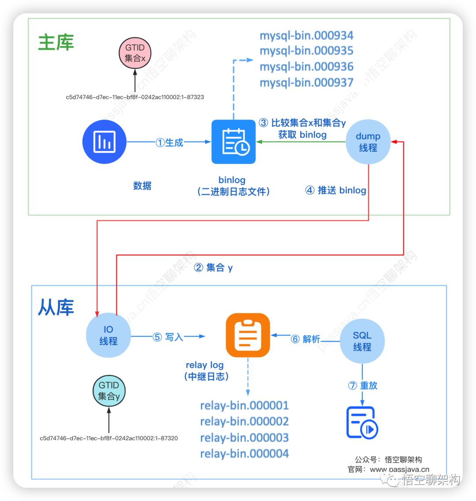
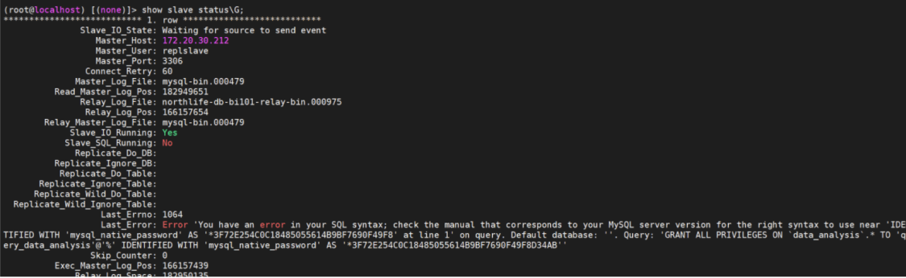
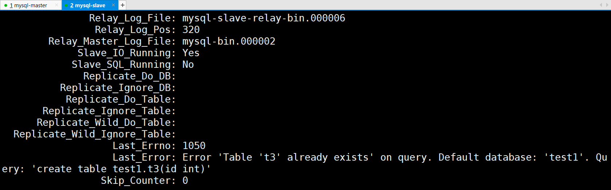
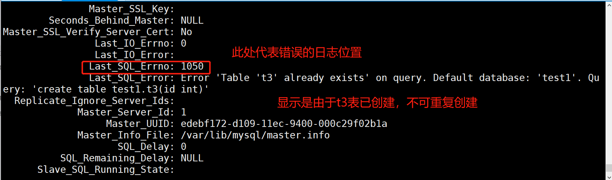
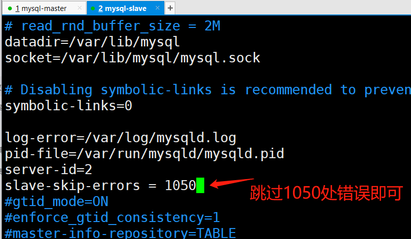
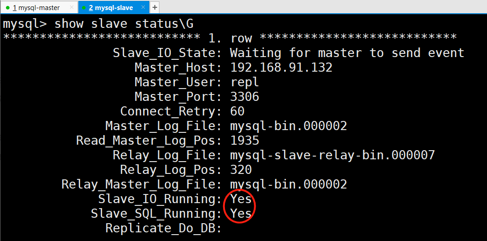

# 关系型数据库介绍

```shell
关系型数据库相当于一个目录，这个目录是存放数据的库。库里存放表，相当于文件。
```

# Oracle数据库应用范围

```shell
大公司、政府、金融
```

# Mysql数据库应用范围

```shell
互联网企业
```

# Mysql和Orale的区别

```http
凯叔表权提佩安
```


```shell
①，Oracle闭源、收费，Mysql开源、免费。

②，Oracle大型数据库、Mysql中小型数据库。

③，Oracle有表空间概念、Mysql没有。

④，Oracle可设置用户权限、访问权限、读写权限等，Mysql没有。

⑤，Oracle需要用户手动提交、Mysql默认自动提交。

⑥，Oracle全面、完整、稳定，对硬件要求高；Mysql使用cup和内存少，性能高。

⑦，Oracle使用许多安全功能，如用户名，密码，配置文件，本地身份证，外部身份验证，高级安全增强功能。Mysql使用三个参数来验证用户，即用户名、密码、位置；数据库认证上Mysql比Oracle认证更加容易。 
```

# Mysql和MariaDB区别

```shell
MariaDB数据库管理系统是Mysql的一个分支，目的是完全兼容Mysql，能够成为Mysql的代替品，运行速度更快。
```

# 关系型数据库与非关系型数据库的区别

```shell
①，关系型数据库
关系型数据库相当于一个目录，这个目录是存放数据的库。库里存放表，相当于文件。

优点：
1、遵循四大事务(原子性、一致性、隔离性、持续性)
2、支持sql语句，可用于表结构的复杂查询。

缺点：
1、读写性能差，海量的数据压力大
2、高并发性能差，传统关系型数据库而言，硬盘I/O是很大的瓶颈
3、固定表结构，灵活度稍欠                
Mysql是常用的关系型数据库。

②，非关系型数据库(Nosql、作为关系型数据库的补充)
非关系型数据是一种数据结构化存储方法的集合，可以是文档或者键值对等

优点：
1、灵活性：存储数据格式灵活可以是key,value形式、文档形式、图片形式等等，使用也灵活，应用场景广泛
2、高性能、速度快：nosql使用硬盘和内存，关系型数据库只能使用硬盘
3、高扩展性
4、成本低：开源

缺：
1、无标准查询语言、不提供sql支持
2、无事务处理能力
3、数据结构相对复杂，复杂查询方面稍欠
Redis是常用的非关系型数据库，且可持久化数据。

③，Mysql数据存储在磁盘中，redis数据存储在磁盘和内存中读写速度快。

④，Mysql端口号：3306、redis端口号：6379
```

# 数据库存储引擎(扩展)

```shell
①，数据库存储引擎

存储引擎是数据库底层软件组织，数据库管理系统(DBMS)使用存储引擎进行创建、查询、更新、删除数据。

②，innodb

支持事务，支持行锁定，对事务的完整性要求比较高(银行)，要求实现并发控制(售票)，适用于频繁更新，删除操作数据库。

③，myisam：较高的查询速度，不支持事务。

④，mermory：读写速度快，安全性不高，对表的大小有要求，支持锁表不支持行锁定。
```

# 事务要符合四个条件(ACID)

```shell
原子性：事务要么成功，要么撤回，不会结束到中间某个环节。

一致性：数据库以及事务永远保持一致性，数据库的完整性不被破坏，即写入的数据必须符合预设的规则。

隔离性：多个事务同时对数据库的数据进行修改时，事务与事务之间存在隔离性。你干你的，我干我的。

持续性：数据会永久存储在永久存储器里
```

# 数据类型 

```shell
1、整型(int)：作用:用户年龄、游戏等级、经验值

2、浮点数类型(float)：作用:用户身高、体重、薪水

3、定点数类型：作用: 货币等精度高的数据

4、字符串类型

(char)固定字符串0~255、长度是固定的，插入数据的长度小于char的固定长度时，则用空格填充。

(varchar)可变长度字符串0~65535、长度是可变的，插入的数据是多长，就按多长来存储。

结合性能角度（char更快），节省磁盘空间角度（varchar更小），经常变化的字段用varchar，超过255字符的只能用varchar或者text

5、枚举类型enum：二选其一

6、日期类型：(year、date、time、datetime、datestamp) 
储存用户注册时间、文章发布时间、文章更新时间、员工入职时间
```

# Mysql备份

```
物理备份：完整备份、增量备份
逻辑备份：mysqldump工具备份
差异备份
```

# 完整备份

```shell
备份完整的数据库数据

优点：备份与恢复操作简单方便，恢复时一次恢复到位，恢复速度快

缺点：占用空间大，备份速度慢
```

# 增量备份

```shell
备份上一次备份到现在产生的新数据

优点：数据量小，占用空间小，备份速度快

缺点：恢复时间长，如中间某次的备份数据损坏，将导致数据的丢失
```

# Mysqldump备份工具原理及使用流程

```shell
原理：
mysqldump备份工具是mysql自带的命令工具，通过sql语句去实现数据的备份和恢复。

备份流程：
1、备份表：
mysqldump -u root -p123 warehouse1 t1 > /home/back/warehouse1.t1.bak

2、备份库：
mysqldump -uroot -p123 warehouse1 > /home/back/warehouse1.bak

3、备份所有库：
mysqldump -uroot -p123 -A > /home/back/allbase.bak

恢复流程：
1、恢复库(先在数据库创建一个新库)
mysql -uroot -p123 warehouse1 < /home/back/warehouse1.bak

2、恢复表
mysql> set sql_log_bin=0;   #停止binlog日志
Query OK, 0 rows affected (0.00 sec)
mysql> source /home/back/warehouse1.t1.bak
```


# 差异备份

```shell
只备份跟完整备份不一样的数据，占用空间会比增量备份大

恢复速度介于完整备份和增量备份之间
```

# 物理备份

```shell
热备 冷备 温备
```

# 备份方式

```shell
每周一次完整备份，平时每天增量备份

日志生命周期：前三十天热备，30-60天温备，60-90天冷备，超过=90天扔掉
```

# Mysql优化

```shell
1、安全方面：修改默认端口号，禁止root用户远程登录，对用户降权，以普通用户运行mysql

2、性能方面：升级硬件，内存、磁盘、优化sql语句（开启慢查询）、设置索引

3、参数变化：innodb的buffer参数调大，连接数调大、缓存的参数优化

4、架构方面：读写分离，一主多从，高可用、mysql的约束添加
```

# 主从复制原理

```shell
主机打开binlog日志，，从机通过io进程读取主机的binlog日志，并将其记录到从库的中继日志里面，sql线程读取中继日志，同步到自己的数据库，实现主从复制。
```

# 主从复制问题如何解决

```http
你在工作当中遇到过什么问题？如何去解决的？
```


```shell
1、查看error日志，排错

2、slave库，show slave status\G 定位io或sql线程
解决故障：

停止从同步
跳过一个事务(跳出出错的一步)
重新开启同步，查看同步状态

如果还不行，就将问题库名的数据，从主库导出，导入从库后，重新主从
配合keepalived做高可用
```

# 主从复制数据不一致如何解决

```http
你在工作当中遇到过什么问题？如何去解决的？
```


```shell
问题原因

①人为误操作在从节点写入数据造成主从binlog节点不同步

②mysql版本不一致，个别语法执行不成功，5.7可以创建用户并授权，8.0必须先创建用户才能授权

解决方法：先停止主从复制，跳过当前事务，再开启主从同步，手动创建用户并授权，保证主从数据一致

问题原因

③主节点允许传送的数据最大是10M，从节点允许传送的数据最大是5M，如果一个7M的数据发送，主节点成功，从节点失败，导致主从数据不一致

解决方法：在mysql配置文件中设置max_allowed_packet（允许的最大数据包）的大小，这也是mysql优化的其中一项
```

# 主从复制模式有几种？

## 异步复制

```shell
MySQL默认的复制即是异步的，主库在执行完客户端提交的事务后会立即将结果返给给客户端，并不关心从库是否已经接收并处理。  
```

## 同步复制

```shell
指当主库执行完一个事务，所有的从库都执行了该事务才返回给客户端。因为需要等待所有从库执行完该事务才能返回，所以全同步复制的性能必然会收到严重的影响。
```

## 半同步复制

```shell
是介于同步复制与异步复制之间的一种，主库只需要等待至少一个从库节点收到并反馈事务即可，主库不需要等待所有从库给主库反馈。同时，这里只是一个收到的反馈，而不是已经完全完成并且提交的反馈，如此，节省了很多时间。
```

# 脏读

```shell
脏读就是修改一个数据，而这种修改还没有提交到数据库中，这时，另外一个事务也访问这个数据，然后使用了这个数据、
```

# 幻读

```shell
第一个事务对表中的数据进行了修改，修改表中的全部数据行。第二个事务也修改这个表中的数据，这种修改是向表中插入一行新数据。那么，会发生操作第一个事务的用户发现表中还有没有修改的数据行，就好象发生了幻觉一样
```

# 不可重复读

```shell
是指在一个事务内，多次读同一数据。在这个事务还没有结束时，另外一个事务也访问该同一数据。由于第二个事务的修改，那么第一个事务两次读到的的数据可能是不一样的。因此称为是不可重复读 
```

# SQL定义了事务隔离级别分为四种

```shell
1、RU读未提交：可能出现脏读、不可重复读和幻读。

2、RC读已提交：可以避免脏读，但可能出现不可重复读和幻读。

3、RR可重复读：可以避免脏读和不可重复读，但可能出现幻读

4、可串行化：可以避免脏读、不可重复读和幻读，但是并发性极低，一般很少使用。

系统默认RR
```

# 数据库的一致性

```shell
就是多个节点中数据的值是一致的

强一致性：写入数据后，立马能读到最新的数据。

弱一致性：写入成功后，不承诺能立马读到最新的值，但在一定时间后能读到。
```

# Sql语句执行慢的原因？如何解决？

```
问题
1、索引不合理：数据量很大，没有合适的索引会造成数据库进行搜索数据，从而导致效率低下。
2、表的结构设计不合理：查询效率低
3、硬件问题：设备老化、内存小、I/O速度慢
4、网络延迟

解决：
1、优化、更新索引，加快sql语句执行效率
2、优化表结构，合理分配内存空间
3、加钱
```


# mysql脏数据是什么概念？

```
数据不在给定的范围内，对实际业务没有意义。数据的格式非法。
```


# mysql主从复制的方式有几种？

```
Gtid
1、master更新数据时，会在事务前产生GTID，一同记录到binlog日志中。
2、slave端的i/o线程将变更的binlog，写入到本地的relay log中。
3、sql线程从relay log中获取GTID，然后对比slave端的binlog是否有记录。
4、如果有记录，说明该GTID的事务已经执行，slave会忽略。
5、如果没有记录，slave就会从relay log中执行该GTID的事务，并记录到binlog。
```



```
Binlog
主机打开binlog日志，，从机通过io进程读取主机的binlog日志，并将其记录到从库的中继日志里面，sql线程读取中继日志，同步到自己的数据库，实现主从复制。
```


# Mysql主从异常解决方案

## 版本不一致

```
主节点：Mysql5.7  从节点：Mysql8.0
```

### 主从同步错误 SQL线程报错

```
问题描述：zabbix报警mysql数据库主从不同步,登录后查询发现SQL线程错误。
解决方案：查看错误代码为1062,1032 导致出现问题的原因有很多,这次并没有去深入分析原因,直接将错误跳过。
1.临时在mysql中操作：
stop slave; # 停止主从复制
SET GLOBAL SQL_SLAVE_SKIP_COUNTER = 1       #跳过一个事务
start slave; # 开启主从复制
show slave status\G # 查看状态
2.在配置文件中永久生效
/etc/my.cnf
在mysql配置文件[mysqld]下面增加
slave-skip-errors = 1064, 1032 # 主从复制时忽略错误
2.今天在进行数据库操作时,导致一个从库发生主从同步错误,ERROR的意思是创建用户的语法错误,在5.7可以,然后在8.0进行Binlog重放错误.
```



```
问题处理：
出现这个错误的原因是在主库执行的语句是创建用户并授权,但是对于8.0数据库,创建用户和授权语句需要分开写,随意会出现以上错误。
```


```
解决步骤：
1.stop slave; 
2.SET GLOBAL SQL_SLAVE_SKIP_COUNTER = 1 跳过这个事务
3.start slave;
4.show slave status\G 查看主从异常是否解决
5.set global read_only=0;
6.create user 'query_data_analysis'@'%' identified by 'Han2rZY7uEn9m!Asana';
7.GRANT all privileges on data_analysis.* to query_data_analysis@'%';
8.set global read_only=1;
9.show global variables like "%read_only%"; 查看是否开启成功
```

### 从节点插入数据导致不一致

```
问题：
从节点插入数据 insert into test1.t1 values(1);
主节点未同步。但是主从未失效，从节点I/O、SQL线程仍为YES，而且主节点创建数据，从节点仍能同步
但是主节点再次插入数据insert into test1.t1 values(1);
出现下面报错：
从节点查看show slave status\G
```





```shell
# 先停止同步
mysql> stop slave;   
Query OK, 0 rows affected (0.01 sec)

# 跳过一个事务，
mysql> set global sql_slave_skip_counter=1;
Query OK, 0 rows affected (0.00 sec)

# 重新开启同步
mysql> start slave;
Query OK, 0 rows affected (0.00 sec)

# 再次查看同步状态
mysql> show slave status\G
```


```
总结：
由于master节点添加的数据，从节点已经存在，导致从节点执行同样的sql语句时报错，从而出现sql线程错误；
但是主从的数据是一致的；
所以只需要从节点执行以上操作即可；

以上方案是临时解决方案：
以下是永久解决方案：

修改从节点mysql的配置文件
```



```shell
[root@mysql-slave ~]# systemctl restart mysqld
[root@mysql-slave ~]# mysql -uroot -p'Qf@12345!'
mysql> show slave status\G
```



# Mysql数据库优化

## 目的

```
通过根据服务器目前状况，修改MySQL的系统参数，达到合理利用服务器现有资源，最大合理的提高MySQL性能。
```

## 服务器参数

```
32G内存、4个CPU,每个CPU 8核
```

## 修改mysql配置

```
打开MySQL配置文件my.cnf
vi  /etc/my.cnf
```

## mysql非缓存参数变量介绍及修改

#### 修改back_log参数值:由默认的50修改为500.（每个连接256kb,占用：125M）

```shell
back_log=500
```

```shell
 back_log值指出在MySQL暂时停止回答新请求之前的短时间内多少个请求可以被存在堆栈中。也就是说，如果MySql的连接数据达到max_connections时，新来的请求将会被存在堆栈中，
以等待某一连接释放资源，该堆栈的数量即back_log，
如果等待连接的数量超过back_log，将不被授予连接资源。将会报：unauthenticated user | xxx.xxx.xxx.xxx | NULL | Connect | NULL | login | NULL 的待连接进程时. back_log值不能超过TCP/IP连接的侦听队列的大小。若超过则无效，查看当前系统的TCP/IP连接的侦听队列的大小命令：cat /proc/sys/net/ipv4/tcp_max_syn_backlog目前系统为1024。对于Linux系统推荐设置为小于512的整数。 修改系统内核参数，）http://www.51testing.com/html/64/n-810764.html 查看mysql 当前系统默认back_log值，命令： show variables like 'back_log'; 查看当前数量
```


#### 修改wait_timeout参数值，由默认的8小时，修改为30分钟。(本次不用)

```shell
wait_timeout=1800（单位为s）
```

```
我对wait-timeout这个参数的理解：
        MySQL客户端的数据库连接闲置最大时间值。 说得比较通俗一点，就是当你的MySQL连接闲置超过一定时间后将会被强行关闭。MySQL默认的wait-timeout  值为8个小时，可以通过命令show variables like 'wait_timeout'查看结果值;。 设置这个值是非常有意义的，比如你的网站有大量的MySQL链接请求（每个MySQL连接都是要内存资源开销的 ），由于你的程序的原因有大量的连接请求空闲啥事也不干，白白占用内存资源，或者导致MySQL超过最大连接数从来无法新建连接导致“Too many connections”的错误。在设置之前你可以查看一下你的MYSQL的状态（可用show processlist)，如果经常发现MYSQL中有大量的Sleep进程，则需要 修改wait-timeout值了。 interactive_timeout：服务器关闭交互式连接前等待活动的秒数。交互式客户端定义为在mysql_real_connect()中使用CLIENT_INTERACTIVE选项的客户端。 wait_timeout:服务器关闭非交互连接之前等待活动的秒数。在线程启动时，根据全局wait_timeout值或全局 interactive_timeout值初始化会话wait_timeout值，取决于客户端类型(由mysql_real_connect()的连接选项CLIENT_INTERACTIVE定义). 这两个参数必须配合使用。否则单独设置wait_timeout无效
```

#### 修改max_connections参数值，由默认的151，修改为1000

```
max_connections=1000
```

```
max_connections是指MySql的最大连接数，如果服务器的并发连接请求量比较大，建议调高此值，以增加并行连接数量，当然这建立在机器能支撑的情况下，因为如果连接数越多，
介于MySql会为每个连接提供连接缓冲区，就会开销越多的内存，所以要适当调整该值，不能盲目提高设值。可以过'conn%'通配符查看当前状态的连接数量，以定夺该值的大小。 MySQL服务器允许的最大连接数16384； 查看系统当前最大连接数： show variables like 'max_connections';
```

#### 修改max_user_connections值，由默认的0，修改为800

```
max_user_connections=100
```

```
max_user_connections是指每个数据库用户的最大连接 针对某一个账号的所有客户端并行连接到MYSQL服务的最大并行连接数。简单说是指同一个账号能够同时连接到mysql服务的最大连接数。设置为0表示不限制。 目前默认值为：0不受限制。 这儿顺便介绍下Max_used_connections:它是指从这次mysql服务启动到现在，同一时刻并行连接数的最大值。它不是指当前的连接情况，而是一个比较值。如果在过去某一个时刻，MYSQL服务同时有1000个请求连接过来，而之后再也没有出现这么大的并发请求时，则Max_used_connections=1000.请注意与show variables 里的max_user_connections的区别。默认为0表示无限大。 查看max_user_connections值 show variables like 'max_user_connections';
```

#### 修改thread_concurrency值，由目前默认的8，修改为64

```
 thread_concurrency=64
```

```
thread_concurrency的值的正确与否, 对mysql的性能影响很大, 在多个cpu(或多核)的情况下，错误设置了thread_concurrency的值, 会导致mysql不能充分利用多cpu(或多核), 出现同一时刻只能一个cpu(或核)在工作的情况。 thread_concurrency应设为CPU核数的2倍. 比如有一个双核的CPU, 那thread_concurrency  的应该为4; 2个双核的cpu, thread_concurrency的值应为8. 比如：根据上面介绍我们目前系统的配置，可知道为4个CPU,每个CPU为8核，按照上面的计算规则，这儿应为:4*8*2=64 查看系统当前thread_concurrency默认配置命令：  show variables like 'thread_concurrency';
```

#### 添加skip-name-resolve，默认被注释掉，没有该参数

```shell
skip-name-resolve
```

```
skip-name-resolve：禁止MySQL对外部连接进行DNS解析，使用这一选项可以消除MySQL进行DNS解析的时间。但需要注意，如果开启该选项，则所有远程主机连接授权都要使用IP地址方式，否则MySQL将无法正常处理连接请求！
```

#### default-storage-engine(设置MySQL的默认存储引擎)

```
default-storage-engine= InnoDB(设置InnoDB类型，另外还可以设置MyISAM类型)
```

## MySQL缓存变量介绍及修改

```
数据库属于IO密集型的应用程序，其主职责就是数据的管理及存储工作。而我们知道，从内存中读取一个数据库的时间是微秒级别，而从一块普通硬盘上读取一个 IO是在毫秒级别，二者相差3个数量级。
所以，要优化数据库，首先第一步需要优化的就是IO，尽可能将磁盘IO转化为内存IO。本文先从MySQL数据库 IO相关参数(缓存参数)的角度来看看可以通过哪些参数进行IO优化
```

#### 全局缓存

```
启动MySQL时就要分配并且总是存在的全局缓存。目前有：key_buffer_size(默认值：402653184,即384M)、innodb_buffer_pool_size(默认值：134217728即：128M)、
innodb_additional_mem_pool_size（默认值：8388608即：8M）、innodb_log_buffer_size(默认值：8388608即：8M)、query_cache_size(默认值：33554432即：32M)等五个。总共：560M. 这些变量值都可以通过命令如：show variables like '变量名';查看到。
```

##### key_buffer_size,本系统目前为384M,可修改为400M

```
key_buffer_size=400M
```

```
key_buffer_size是用于索引块的缓冲区大小，增加它可得到更好处理的索引(对所有读和多重写)，对MyISAM(MySQL表存储的一种类型，可以百度等查看详情)表性能影响最大的一个参数。如果你使它太大，系统将开始换页并且真的变慢了。
严格说是它决定了数据库索引处理的速度，尤其是索引读的速度。对于内存在4GB左右的服务器该参数可设置为256M或384M. 怎么才能知道key_buffer_size的设置是否合理呢，一般可以检查状态值Key_read_requests和Key_reads   ，比例key_reads / key_read_requests应该尽可能的低，比如1:100，1:1000 ，1:10000。其值可以用以下命令查得：show status like 'key_read%'; 比如查看系统当前key_read和key_read_request值为： 
```


```
可知道有28535个请求，有269个请求在内存中没有找到直接从硬盘读取索引. 未命中缓存的概率为：0.94%=269/28535*100%.  一般未命中概率在0.1之下比较好。目前已远远大于0.1，证明效果不好。若命中率在0.01以下，则建议适当的修改key_buffer_size值。 
```

```
http://dbahacker.com/mysql/innodb-myisam-compare(InnoDB与MyISAM的六大区别) http://kb.cnblogs.com/page/99810/（查看存储引擎介绍） 
MyISAM、InnoDB、MyISAM Merge引擎、InnoDB、memory(heap)、archive
```

