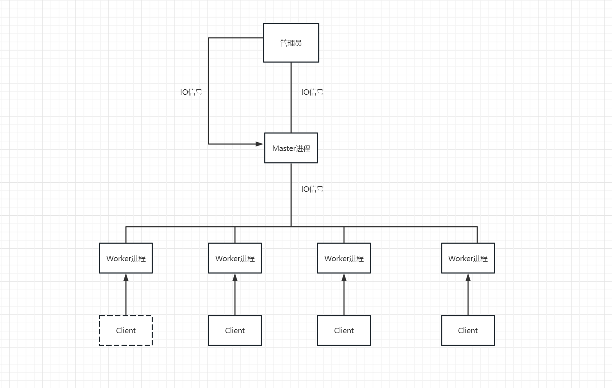
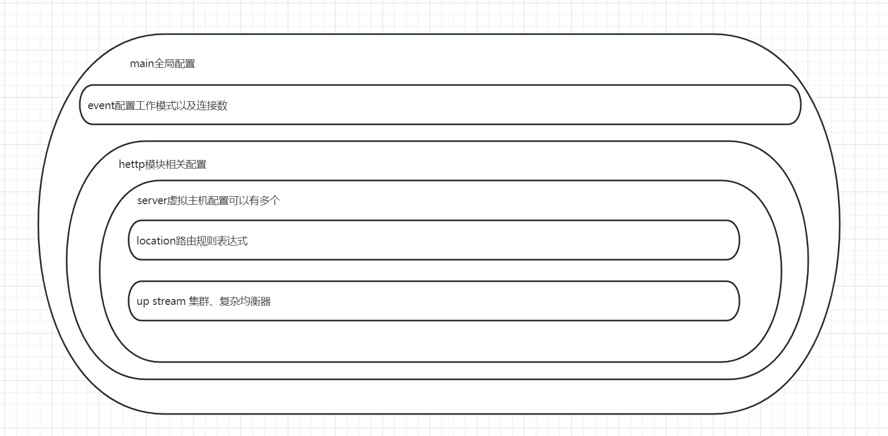
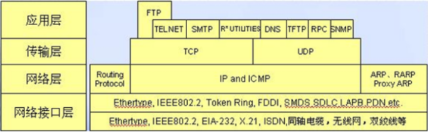

# HTTP三点注意事项

```shell
无连接:
含义：限制每次连接只处理一个请求
特点：节省传输时间
```


```shell
媒体独立:
任何类型数据都可以通过http发送
```


```shell
无状态:
含义：协议对于事务处理没有记忆能力
```

# http请求方法

```shell
get：单纯获取数据（获取一个index.html页面）

post：上传/创建文件（会产生新的数据）

put：保存数据（覆盖/更新文件、图片等，不会产生新的数据）

delete：删除
```

# 常见http状态码，页面报错如何解决？

```shell
200：请求成功。一般用于get与post请求
301：永久移动。资源（网页等）被永久转移到其它URL
302：临时移动。资源（网页等）临时转移到其它URL
304：未修改
400：客户端请求的语法错误，服务器无法理解
403：拒绝执行此请求
404：请求的资源（网页等）不存在
500：内部服务器错误
502：远程服务器接收到了一个无效的响应
```


```
解决方法：
404：可以检查请求的资源是否存在，是否正确地拼写了URL。
500：可以检查Nginx服务器的配置文件、日志文件等，找出错误原因并修复。
nginx的access.log和error.log会记录报错信息，根据信息可进行排查。
```

# Nginx介绍

## 是什么？

```shell
①高性能web服务器

②正反代理服务器

③进行四层七层负载均衡

④性能强大且丰富

⑤支持地址重写⑥防盗链。
```

## 特点

```shell
①稳定性
②丰富功能集
③示例配置文件
④低系统资源消耗
⑤占用内存少
⑥并发能力强
```

## Nginx和Apache区别

```shell
Nginx
①内存和资源占比低
②抗并发性能强
③处理请求:异步非阻塞
④适合静态页面、动态性能较差

Apache
①处理请求:阻塞型
②静态页面与动态页面稳定

总结
性能→Nginx
稳定→Apache
```

## nginx工作原理

```shell
Nginx采用多线程IO多路复用，nginx启动后，会开启master线程和多个worker线程，master负责管理多个worker线程，当有请求进来时，会通过Nginx配置文件将请求映射到对应的location模块，location模块会将请求进行处理。
```

## nginx缺点

```shell
1.处理动态请求效果差，单进程多线程模式，进程死掉会影响很多用户。

2.对后端服务器的健康检查，只支持通过端口检测，不支持url来检测。
```

# 为什么选择nginx

```shell
作为web服务器：资源占用少、并发量高
作为负载均衡器：支持作为 HTTP代理服务器对外进行服务
作为邮件代理服务器：安装简单、配置文件简洁、支持perl语法、Bug少
不间断运行、支持热升级
```

# 异步、非阻塞、异步回调

```shell
异步：不需要主动等待结果的返回，而是通过其他手段，比如状态通知，回调函数等。

非阻塞：是指结果在返回之前，线程可以做一些其他事，不会被挂起。

异步回调：异步回调是一个可以无需等待被调用函数的返回值就让操作继续进行的方法。
```

# Nginx高并发的原因



```shell
客户端每进来一个请求，会有一个worker进程，调用io 进行处理，如果不能立即得到结果，就去处理其他请求（即为 非阻塞 ），客户端在此期间 也无需等待响应，可以去处理其他事情（即为 异步），当 io 返回时，就会通知此worker进程，暂时挂起当前处理的事务去响应客户端请求。
```

# 正向代理和反向代理

## 正向代理

```shell
正向代理的过程隐藏了真实的请求客户端，服务器不知道真实的客户端是谁，客户端请求的服务都被代理服务器代替请求。
```

## 反向代理

```shell
反向代理的过程隐藏了真实的服务器，客户不知道真正提供服务的人是谁，客户端请求的服务都被代理服务器处理。
```

# Nginx.conf组成



# Nginx虚拟主机配置server

```shell
什么是虚拟主机？："网络空间"，将运行在互联网上的物理服务器划分成多个"虚拟"服务器。

虚拟主机的作用：①方便管理②提高性能③降低成本

基于域名的虚拟主机

基于ip的虚拟主机

基于端口的虚拟主机
```

# Nginx负载均衡配置

```shell
轮询(使用最多)：支持4种负载均衡调度算法。

ip_hash：每个请求按访问IP的hash结果分配，同一个IP客户端固定访问一个后端服务器。

url_hash：按访问url的hash结果来分配请求，使每个url定向到同一个后端服务器。

fair：更加智能的负载均衡算法。必须下载Nginx的 upstream_fair 模块。
```

# nginx配置7层协议及4层协议办法(扩展)

## OSI7层协议

```
记忆口诀：
1、Please Do Not Tell Stupid People Anything
2、All People Seem To Need Data Processing
```


```
应用层(http、https、ssh、ftp)
表示层
会话层
传输层(TCP、UTP)端口
网络层(ICMP)ip地址
数据链路层(ARP)mac地址
物理层
```

```
TCP协议：
TCP协议通过三次握手建立连接，保证数据可靠性。
在文件传输、电子邮件、网页广泛运用。
```

```
UTP协议：
不保证数据包的可靠性，传播的速度快，效率高。
在音频、直播、视频广泛运用。
```

```
ICMP协议：
ping命令发送ICMP回显请求到目标的主机。
```


## TCP/IP4层协议



## 协议配置

```shell
nginx工作在4，5，6，7层

区别：见LVS
```

# Nginx会话保持

## ip_hash

```shell
ip_hash使用源地址哈希算法，将同一客户端的请求总是发往同一个后端服务器，除非该服务器不可用。

ip_hash简单易用，但有如下问题： 当后端服务器宕机后，session会话丢失； 同一客户端会被转发到同一个后端服务器，可能导致负载失衡。
```

## sticky_cookie_insert

```shell
使用sticky_cookie_insert启用会话亲缘关系，这会导致来自同一客户端的请求被传递到一组服务器的同 一台服务器。与ip_hash不同之处在于，它不是基于IP来判断客户端的，而是基于cookie来判断。因此可 以避免上述ip_hash中来自同一客户端导致负载失衡的情况。(需要引入第三方模块才能实现)。
```

## jvm_route

```shell
1、一开始请求过来，没有带session信息，jvm_route就根据轮询（round robin）的方法，发到一台 tomcat上面。 

2、tomcat添加上session 信息，并返回给客户。

3、用户再此请求，jvm_route看到session中有后端服务器的名称，它就把请求转到对应的服务器上。
```

# Nginx实现动静分离

```shell
①代理服务器
②静态资源配置
③动态资源配置
```

# Nginx防盗链问题

## 原理

```shell
nginx 防止网站资源被盗用模块。referer module后面跟上限制.
```

## 防盗链配置

```shell
none：允许没有http_referer的请求访问资源； 为空则能访问，有值则不能

blocked：允许不是http://开头的，不带协议的请求访问资源---被防火墙过滤掉的

server_names： 只允许指定ip/域名来的请求访问资源（白名单）
```

## 目的

```
保护公司网络资源不会被恶意盗链和滥用。比如网站上使用的一些图片和资源，如果不保护，被其他网站盗用，会导致流量的损失、增加服务器压力。
```

# 什么是Rewrite

```shell
URL重写，就是把传入Web的请求重定向到其他URL的过程
```

# rewrite相关指令

## return指令

```shell
last：相当于Apache里的[L]标记，表示完成rewrite。默认为last

break：本条规则匹配完成后，终止匹配，不再匹配后面的规则
```

## redirect

```shell
返回302临时重定向，浏览器地址会显示跳转后的URL地址（不一定）
```

## permanent

```shell
返回301永久重定向，浏览器地址会显示跳转后URL地址
```

# 负载均衡

```shell
配置一台负载均衡器，客户访问服务器，通过负载均衡器分发给不同的服务器，以此减轻服务器的压力。通过添加upstream模块，upsterea负载均衡算法支持轮询，加权轮询，ip_hash, url_hash。
```

# Nginx 的 HTTP 配置主要包括三个区块

```shell
http { 						# 这个是协议级别
　　include mime.types;
　　default_type application/octet-stream;
　　keepalive_timeout 65;
　　gzip on;
　　　　server {			 # 这个是服务级别
　　　　　　listen 80;
　　　　　　server_name localhost;
　　　　　　location / {  # 这个是请求级别
　　　　　　　　root html;
　　　　　　　　index index.html index.htm;
　　　　　　}
　　　   }
}
```

# location前缀含义

```shell
=：表示精确匹配，优先级也是最高的 

~：表示区分大小写的正则匹配  

/：通用匹配，任何请求都会匹配到
```

# location配置示例

```shell
1、没有修饰符 表示：必须以指定模式开始
2、=表示：必须与指定的模式精确匹配
3、~ 表示：指定的正则表达式要区分大小写
4、~* 表示：指定的正则表达式不区分大小写
```

# 查找顺序和优先级

```shell
= 大于 ^~  大于 ~|~*|!~|!~* 大于 /
多个location配置的情况下匹配顺序为：首先匹配 =，其次匹配^~, 其次是按正则匹配，最后是交给 / 通用匹配。当有匹配成功时候，停止匹配，按当前匹配规则处理请求。
================================================
(1) =:表示完全匹配;
(2) ^~:匹配URI的前缀，如果一个URI同时满足两个规则的话，匹配最长的规则;
(3) ~:匹配正则表达式，大小写敏感；
(4) ~*:匹配正则表达式，大小写不敏感；
优先级：（1）> (2) > (3) = (4)
```

```shell
location 区段匹配示例

location = / {
　　# 只匹配 / 的查询.
　　[ configuration A ]
}
location / {
　　# 匹配任何以 / 开始的查询，但是正则表达式与一些较长的字符串将被首先匹配。
　　[ configuration B ]
}
location ^~ /images/ {
　　# 匹配任何以 /images/ 开始的查询并且停止搜索，不检查正则表达式。
　　[ configuration C ]
}
location ~* \.(gif|jpg|jpeg)$ {
　　# 匹配任何以gif, jpg, or jpeg结尾的文件，但是所有 /images/ 目录的请求将在Configuration C中处理。
　　[ configuration D ]
} 
各请求的处理如下例：
	/ → configuration A
	/documents/document.html → configuration B
	/images/1.gif → configuration C
	/documents/1.jpg → configuration D
```

# root、alias指令区别

```shell
location /img {
    alias /var/www/image;
    index index.html;
}

http://192.168.153.231/img  ---> /var/www/image/index.html
#若按照上述配置的话，则访问/img/目录里面的文件时，ningx会自动去/var/www/image/目录找文件
location /img {
    root /var/www/image;
    index index.html;
} 

#若按照这种配置的话，则访问/img/目录下的文件时，nginx会去/var/www/image/img/目录下找文件。
http://192.168.153.231/img  ---> /var/www/image/img/index.html
```

# 为什么要对Nginx进行平滑升级

```shell
随着 nginx 越来越流行，并且 nginx 的优势也越来越明显， nginx 的版本迭代也来时加速模式， 1.9.0版本的nginx更新了许多新功能，伴随着 nginx 的广泛应用，版本升级必然越来越快，线上业务不 能停，此时 nginx 的升级就需要平滑升级。
```

# Nginx平滑升级的原理

```shell
（1）在不停掉老进程的情况下，启动新进程。 

（2）老进程负责处理仍然没有处理完的请求，但不再接受处理请求。 

（3）新进程接受新请求。 

（4）老进程处理完所有请求，关闭所有连接后，停止。
```

# 什么是流量控制？

```shell
限制用户在给定时间内HTTP请求的数量，用作安全目的，比如减慢暴力密码破解速率。
```

# 变量的可用性？

```shell
location标签中声明的变量中对这个location块可用
server标签中声明的变量对server块以及server块中的所有子块可用
http标签中声明的变量对http块以及http块中的所有子块可用
```

# http和https区别

```shell
1.安全性不同，Http是超文本传输协议，信息是明文传输，Https则是具有安全性的SSL加密传输协议.

2.响应速度不同，http比https的响应速度更快

3.端口不同http默认访问80端口，https是443端口

4.消耗资源不同，https是构建在SSL之上的http协议，所以https会消耗更多的服务器资源

5.费用不同，https需要购买ssl安全证书，会产生一定的费用
```

# 什么是动静分离？

```shell
把动态页面和静态页面由不同的服务器来解析，加快解析速度。降低服务器的压力。
```

# nginx会话保持是什么概念？

```shell
会话保持是指在“会话”持续或“会话”完成一个任务的时间段内，将客户端请求引导至同一个后端Web 服务器。
```

# nginx会话保持的方式有几种？

```shell
Nginx会话保持一般有基于ip_hash和基于cookie两种方式，
```

# nginx反向代理和正向代理有什么区别？

```
正向代理：
nginx作为客户端代理请求，访问一些不能直接访问的资源。
例如：企业对外界隐藏的资源，国家对某些网站进行限制，需通过代理服务器访问。

反向代理：
nginx作为服务端代理的请求，客户端并不知道真实的服务器，有利于减轻单台服务器的压力，提高系统的可靠性和安全性。

总之：
正向代理用于保护客户端隐私和访问权限，反向代理用于保护服务器隐私和减轻服务器压力。
```

# nginx的gzip压缩有什么作用？怎么做？什么情况下需要压缩？

```
要压缩的原因：
http是明文传输，数据量大，会造成网络传输负载过重，导致页面加载缓慢。

gzip压缩的作用：
压缩数据，有利于减少传输的数据量和时间，提升加载的速度。

原理：
通过压缩算法，将http响应的数据进行压缩，将压缩的数据传给客户端，客户端再进行解压和读取。

怎么做？
要在 Nginx 中启用 gzip 压缩，可以在 Nginx 配置文件中加入以下代码：
gzip on;
gzip_types text/plain text/css application/json application/x-javascript text/xml application/xml application/xml+rss text/javascript;
```

# nginx怎么优化？

```
1、合理配置nginx：
精简配置文件，只保留必要的指令，其他全部扔掉，保证服务器性能。

2、增加缓存：
加钱、可缓存大部分静态资源，提高速度

3、调整work process：
work process决定了nginx能同时处理的连接数。
要是太少，会导致高并发情况下，连接被拒绝。
要是太多，会导致资源浪费。
因此，需要根据实际情况进行及时的调整。

4、使用https加密协议：
有利于保护数据安全，可能会增加服务器的负担，根据实际情况添加。
```

# 7层负载均衡怎么做？

```shell
1、upstream指定服务器。

2、配置server段：
指定所监听的端口号和域名，以及location、proxy_pass选项

3、配置负载均衡策略：
nginx默认的策略是rolad-robin(轮询)，如需要使用其他负载均衡算法，可在upstream设置

4、配置健康检查
健康检查有效避免将请求分发给不同服务器，提高系统可用性。可以通过health_check进行健康检查
```


~~~shell
1. 安装Nginx并配置反向代理。假设我们有3个web服务器，可以在Nginx中配置upstream来指向这3个服务器：

```
upstream backend {
    server 192.168.0.1;
    server 192.168.0.2;
    server 192.168.0.3;
}
```

2. 配置server段。在Nginx的server段中，我们可以指定监听的端口号和域名，以及对应的location和proxy_pass选项：

```
http {
    server {
        listen 80;
        server_name example.com;

        location / {
            proxy_pass http://backend;
        }
    }
}
```

3. 配置负载均衡策略。Nginx默认的负载均衡策略是轮询（round-robin），即每个请求依次分发给后端服务器。如果需要使用其他负载均衡算法，可以在upstream中设置。例如，我们可以使用IP hash算法，将同一个IP的请求固定分发到同一台服务器：

```
upstream backend {
    ip_hash;
    server 192.168.0.1;
    server 192.168.0.2;
    server 192.168.0.3;
}
```

4. 配置健康检查。健康检查可以有效地避免将请求分发给不可用的服务器，提高系统的可用性。在Nginx中，我们可以通过设置health_check选项来实现健康检查。例如，以下配置将每5秒对每个后端服务器的/health接口进行一次健康检查：

```
upstream backend {
    server 192.168.0.1:8080;
    server 192.168.0.2:8080;
    server 192.168.0.3:8080;

    health_check interval=5s;
}
```
~~~

# nginx的隐藏版本号是什么？

```
隐藏在http响应头中的nginx服务器版本号的做法。
作用：
增加服务器安全性，减少被攻击的风险。
```

# 动态请求和静态请求有什么区别？

```
动态请求：跟数据库有交互的请求，服务器根据客户端的请求，返回给客户端的资源。
例如：php

静态请求：跟数据库无交互的请求，客户端请求的资源已经在服务器上了。
例如：html、JavaScript

动态请求需要根据客户端的请求，返回给客户端资源，所以响应的速度慢一些。动态请求需要更高配置的服务器和复杂的逻辑代码。
```

# 访问nginx程序比较慢，怎么去处理？

```http
一台服务器比较卡，应该怎么去做？
```


```
top查看cpu和内存使用率、杀死不用的进程

1、资源不足：
服务器配置低或访问量大，导致资源不足。应当升级或扩容服务器。

2、DNS解析时间长：
将DNS解析结果缓存到本地，或用快速的DNS服务器

3、I/O速度慢：
使用SSD高速磁盘

4、nginx配置问题：
worker_connections过小、keepalive_timeout时间过长

5、网络延迟
```

# nginx优化参数有哪些？哪些模块有哪些作用？

```
参数优化：
1、worker_processes：
指定worker进程数，建议cpu核数
2、worker_connections：
worker进程最大连接数，建议设为1024
3、keepalived_timeout：
http keepalived最大并发连接数。在高并发场景可设置几秒或更长的时间。

常用模块：
1、rewrite：
地址重写
2、proxy：
反向代理，转发客户端请求到后端服务器
3、upstream：
后端服务器分组，实现负载均衡和高可用
4、gzip：
数据压缩，减少网络传输量，提高响应速度
5、access.log
记录客户端请求日志
```


