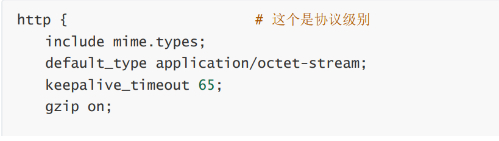
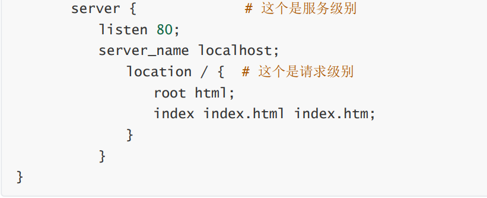
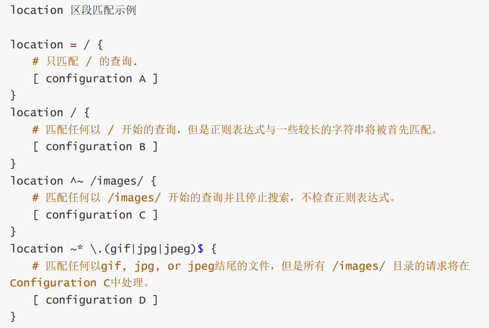
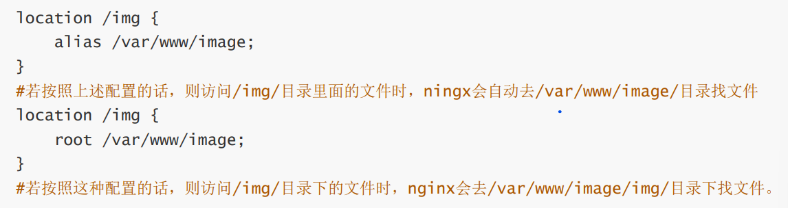
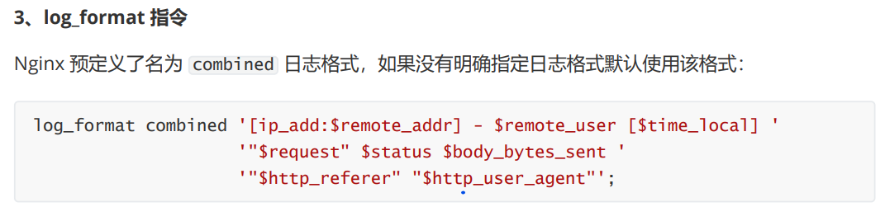
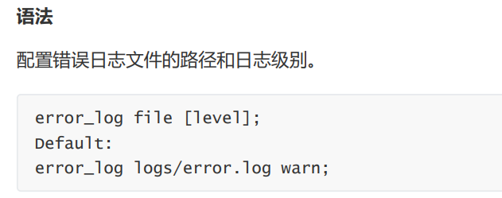
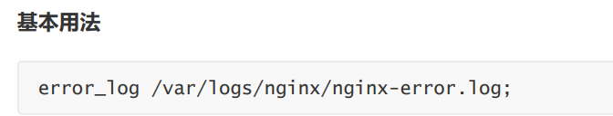
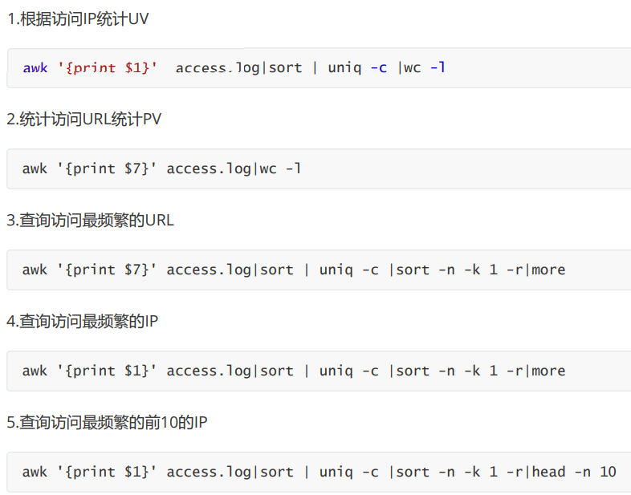

# HTTP三点注意事项

## 	无连接

```shell
含义：限制每次连接只处理一个请求
特点：节省传输时间
```

## 	媒体独立

```shell
任何类型数据都可以通过http发送
```

## 	无状态

```shell
含义：协议对于事务处理没有记忆能力
```

# http请求方法

```shell
get：单纯获取数据（获取一个index.html页面）

post：上传/创建文件（会产生新的数据）

put：保存数据（覆盖/更新文件、图片等，不会产生新的数据）

delete：删除
```

# 常见http状态码

```shell
200：请求成功。一般用于get与post请求
301：永久移动。资源（网页等）被永久转移到其它URL
302：临时移动。资源（网页等）临时转移到其它URL
304：未修改
400：客户端请求的语法错误，服务器无法理解
403：拒绝执行此请求
404：请求的资源（网页等）不存在
500：内部服务器错误
502：远程服务器接收到了一个无效的响应
```

# Nginx介绍

## 是什么？

```shell
①高性能web服务器②正反代理服务器③进行四层七层负载均衡④性能强大且丰富⑤支持地址重写⑥防盗链。
```

## 特点

```shell
①稳定性②丰富功能集③示例配置文件④低系统资源消耗⑤占用内存少⑥并发能力强
```

## Nginx和Apache区别

```shell
Nginx
①内存和资源占比低
②抗并发性能强
③处理请求:异步非阻塞
④适合静态页面、动态性能较差

Apache
①处理请求:阻塞型
②静态页面与动态页面稳定

总结
性能→Nginx
稳定→Apache
```

## nginx工作原理

```shell
Nginx采用多线程IO多路复用，nginx启动后，会开启master线程和多个worker线程，master负责管理多个worker线程，当有请求进来时，会通过Nginx配置文件将请求映射到对应的location模块，location模块会将请求进行处理。
```

## nginx缺点

```shell
1.处理动态请求效果差，单进程多线程模式，进程死掉会影响很多用户。

2.对后端服务器的健康检查，只支持通过端口检测，不支持url来检测。如果用户正在上传一个文件，而处理该上传的节点在上传过程中出现故障，Nginx会把上传切到另一台服务器重新处理。
```

# 为什么选择nginx

```shell
作为web服务器：资源占用少、并发量高
作为负载均衡器：支持作为 HTTP代理服务器对外进行服务
作为邮件代理服务器：安装简单、配置文件简洁、支持perl语法、Bug少
不间断运行、支持热升级
```

# 异步、非阻塞、异步回调

```shell
异步：不需要主动等待结果的返回，而是通过其他手段，比如状态通知，回调函数等。

非阻塞：是指结果在返回之前，线程可以做一些其他事，不会被挂起。

异步回调：异步回调是一个可以无需等待被调用函数的返回值就让操作继续进行的方法。
```

# Nginx高并发的原因


```shell
客户端每进来一个请求，会有一个worker进程，调用io 进行处理，如果不能立即得到结果，就去处理其他请求（即为 非阻塞 ），客户端在此期间 也无需等待响应，可以去处理其他事情（即为 异步），当 io 返回时，就会通知此worker进程，暂时挂起当前处理的事务去响应客户端请求。
```

# 正向代理和反向代理

## 正向代理

```shell
正向代理的过程隐藏了真实的请求客户端，服务器不知道真实的客户端是谁，客户端请求的服务都被代理服务器代替请求。
```

## 反向代理

```shell
反向代理的过程隐藏了真实的服务器，客户不知道真正提供服务的人是谁，客户端请求的服务都被代理服务器处理。
```

# Nginx.conf组成


# Nginx虚拟主机配置server

```shell
什么是虚拟主机？："网络空间"，将运行在互联网上的物理服务器划分成多个"虚拟"服务器。

虚拟主机的作用：①方便管理②提高性能③降低成本

基于域名的虚拟主机

基于ip的虚拟主机

基于端口的虚拟主机
```

# Nginx负载均衡配置

```shell
轮询(使用最多)：支持4种负载均衡调度算法。

ip_hash：每个请求按访问IP的hash结果分配，同一个IP客户端固定访问一个后端服务器。

url_hash：按访问url的hash结果来分配请求，使每个url定向到同一个后端服务器。

fair：更加智能的负载均衡算法。必须下载Nginx的 upstream_fair 模块。
```

# nginx配置7层协议及4层协议办法(扩展)

## OSI7层协议


## TCP/IP4层协议


## 协议配置

```shell
nginx工作在4，5，6，7层

区别：四层负载均衡基于IP和端口，复杂度低，性能高（无需解析内容），安全性低。七层负载均衡基于url（网址）或主机ip，复杂度高，性能一般，安全性高，功能丰富可以进行会话保持，图片压缩。

四层负载架构设计比较简单，无需解析具体的消息内容，在网络吞吐量及处理能力上会相对比较高，而七层负载均衡的优势则体现在功能多，控制灵活强大。
```

# Nginx会话保持

## ip_hash

```shell
ip_hash使用源地址哈希算法，将同一客户端的请求总是发往同一个后端服务器，除非该服务器不可用。

ip_hash简单易用，但有如下问题： 当后端服务器宕机后，session会话丢失； 同一客户端会被转发到同一个后端服务器，可能导致负载失衡。
```

## sticky_cookie_insert

```shell
使用sticky_cookie_insert启用会话亲缘关系，这会导致来自同一客户端的请求被传递到一组服务器的同 一台服务器。与ip_hash不同之处在于，它不是基于IP来判断客户端的，而是基于cookie来判断。因此可 以避免上述ip_hash中来自同一客户端导致负载失衡的情况。(需要引入第三方模块才能实现)。
```

## jvm_route

```shell
1、一开始请求过来，没有带session信息，jvm_route就根据轮询（round robin）的方法，发到一台 tomcat上面。 

2、tomcat添加上session 信息，并返回给客户。

3、用户再此请求，jvm_route看到session中有后端服务器的名称，它就把请求转到对应的服务器上。
```

# Nginx实现动静分离

```shell
①代理服务器②静态资源配置③动态资源配置
```

# Nginx防盗链问题

## 原理

```shell
nginx 防止网站资源被盗用模块。referer module后面跟上限制.
```

## 防盗链配置

```shell
none：允许没有http_referer的请求访问资源； 为空则能访问，有值则不能

blocked：允许不是http://开头的，不带协议的请求访问资源---被防火墙过滤掉的

server_names： 只允许指定ip/域名来的请求访问资源（白名单）
```

# 什么是Rewrite

```shell
URL重写，就是把传入Web的请求重定向到其他URL的过程
```

# rewrite相关指令

## return指令

```shell
last：相当于Apache里的[L]标记，表示完成rewrite。默认为last

break：本条规则匹配完成后，终止匹配，不再匹配后面的规则
```

## redirect

```shell
返回302临时重定向，浏览器地址会显示跳转后的URL地址（不一定）
```

## permanent

```shell
返回301永久重定向，浏览器地址会显示跳转后URL地址
```

# 负载均衡

```shell
配置一台负载均衡器，客户访问服务器，通过负载均衡器分发给不同的服务器，以此减轻服务器的压力。通过添加upstream模块，upsterea负载均衡算法支持轮询，加权轮询，ip_hash, url_hash。
```

# http配置区段





# location前缀含义

```shell
=：表示精确匹配，优先级也是最高的 

~：表示区分大小写的正则匹配  

/：通用匹配，任何请求都会匹配到
```

# location配置示例

```shell
1、没有修饰符 表示：必须以指定模式开始
2、=表示：必须与指定的模式精确匹配
3、~ 表示：指定的正则表达式要区分大小写
4、~* 表示：指定的正则表达式不区分大小写
```

# 查找顺序和优先级



# root、alias指令区别



# log_format指令



# error_log指令





# 为什么要对Nginx进行平滑升级

```shell
随着 nginx 越来越流行，并且 nginx 的优势也越来越明显， nginx 的版本迭代也来时加速模式， 1.9.0版本的nginx更新了许多新功能，伴随着 nginx 的广泛应用，版本升级必然越来越快，线上业务不 能停，此时 nginx 的升级就需要平滑升级。
```

# Nginx平滑升级的原理

```shell
（1）在不停掉老进程的情况下，启动新进程。 

（2）老进程负责处理仍然没有处理完的请求，但不再接受处理请求。 

（3）新进程接受新请求。 

（4）老进程处理完所有请求，关闭所有连接后，停止。
```

# 什么是流量控制？

```shell
限制用户在给定时间内HTTP请求的数量，用作安全目的，比如减慢暴力密码破解速率。
```

# 变量的可用性？

```shell
location标签中声明的变量中对这个location块可用
server标签中声明的变量对server块以及server块中的所有子块可用
http标签中声明的变量对http块以及http块中的所有子块可用
```

# PV：访问量  UV：独立访问



# http和https区别

```shell
1.安全性不同，Http是超文本传输协议，信息是明文传输，Https则是具有安全性的SSL加密传输协议.
2.响应速度不同，http比https的响应速度更快
3.端口不同http默认访问80端口，https是443端口
4.消耗资源不同，https是构建在SSL之上的http协议，所以https会消耗更多的服务器资源
5.费用不同，https需要购买ssl安全证书，会产生一定的费用
```

# 什么是动态分离？

```shell
把动态页面和静态页面由不同的服务器来解析，加快解析速度。降低服务器的压力。
```

# nginx会话保持是什么概念？

```shell
会话保持是指在“会话”持续或“会话”完成一个任务或一个事务的时间段内，将客户端请求引导至同一个后端Web 服务器或应用服务器。
```

# nginx会话保持的方式有几种？

```shell
Nginx会话保持一般有基于ip_hash和基于cookie两种方式，尽管Nginx的会话保持可以使某个ip客户端访问固定的后端服务器，但这可能会导致负载的不均衡。
```

# nginx反向代理和正向代理有什么区别？

```shell
正向代理的典型用途是为在防火墙内的局域网客户端提供访问Internet 的途径。 正向代理还可以使用缓冲特性减少网络使用率。 反向代理的典型用途是将防火墙后面的服务器提供给Internet 用户访问。 反向代理还可以为后端的多台服务器提供负载平衡，或为后端较慢的服务器提供缓冲服务。
```

# nginx防盗链原理

```shell
nginx防盗链是通过HTTP的referer机制来实现的。
HTTP协议中，referer头用于表示请求发送源地址。当一个浏览器向服务器请求某个资源时，referer头会告诉服务器这个请求来自于哪个网页。在nginx的防盗链配置中，可以通过限制referer头的值来限制资源的访问。只有符合条件的referer才会被允许访问资源。
```

# nginx的gzip压缩有什么作用？怎么做？什么情况下需要压缩？

````shell
在 Web 开发中，由于 HTTP 协议是明文传输，数据量会比较大，可能会造成网络传输的负载过重，也会导致页面加载速度变慢。为了解决这些问题，可以使用 Nginx 的 gzip 压缩功能来将服务器传输给客户端的数据进行压缩，从而减少传输的数据量和时间，提升页面的加载速度。

具体来说， gzip 压缩可以将 HTTP 响应体的数据进行压缩，减小传输的数据大小，从而在一定程度上减轻网络负担、提高响应速度。gzip 压缩的原理是通过压缩算法，将 HTTP 响应体中的文本内容进行压缩，然后在将压缩后的数据反馈给客户端，客户端再进行解压和显示。

要在 Nginx 中启用 gzip 压缩，可以在 Nginx 配置文件中加入以下代码：

```
gzip on;
gzip_types text/plain text/css application/json application/x-javascript text/xml application/xml application/xml+rss text/javascript;
```

其中，gzip on 表示启用 gzip 压缩，gzip_types 指定需要压缩的 MIME 类型，多个类型之间用空格分隔。

一般情况下，如果您的网站有大量文本类数据（如 HTML、CSS、JavaScript、XML 等），并且网络中的带宽较窄，那么启用 gzip 压缩会对网站访问速度的提升有非常明显的效果。但如果您的网站主要是图片或者其他二进制数据，启用 gzip 压缩则效果不显著，还容易出现压缩效率不高的问题。因此，需根据实际情况来决定是否采用 gzip 压缩。
````

# nginx常见的状态码，都有什么含义，页面报错怎么去解决？

```
Nginx常见的状态码有：

- 200 OK：表示请求被成功处理并返回了所需内容。
- 301 Moved Permanently：表示请求的资源已经被移动到新的地址。
- 302 Found：表示请求的资源已经被临时移动到新的地址。
- 403 Forbidden：表示服务器拒绝了请求。
- 404 Not Found：表示未能找到请求的资源。
- 500 Internal Server Error：表示服务器遇到了错误，无法完成请求。

当页面出现报错时，可以根据报错的状态码进行排查和解决。例如：

- 如果是404 Not Found错误，可以检查请求的资源是否存在，是否正确地拼写了URL。
- 如果是500 Internal Server Error错误，可以检查Nginx服务器的配置文件、日志文件等，找出错误原因并修复。

通常情况下，Nginx会记录下状态码和错误原因信息，在Nginx的访问日志和错误日志里可以查看到详细信息，可以根据这些信息来排查和解决问题。
```


# nginx怎么优化？

```
优化 Nginx 可以从以下几个方面入手：

1. 合理配置 Nginx：Nginx 的配置文件需要精简，去掉不必要的指令，只保留必要的指令，这样可以避免因配置过多而影响服务器性能。

2. 增加缓存：Nginx 可以缓存大部分静态文件，比如图片、CSS、JavaScript 文件，从而避免每次请求都要去请求服务器获取数据，从而提高速度。

3. 调整 Nginx 的 worker process 数：Nginx 的 worker process 数量是一个非常重要的参数，它的大小决定了 Nginx 能够同时处理的连接数。如果 worker process 太小，在高并发时就会出现连接被拒绝的情况，如果过大则会导致服务器资源浪费。所以我们需要根据服务器的实际情况来调整 worker process 数。

4. 开启 TCP 和 HTTP 优化参数：Nginx 支持开启一些 TCP 和 HTTP 的优化参数，比如 TCP_NODELAY 和 TCP_CORK，可以有效减少 TCP 的延迟和提高传输效率，从而提高服务器的性能。

5. 使用 HTTPS 加密协议：HTTPS 是安全加密的协议，可以有效的保护数据的安全和完整性，这也是现在很多网站推荐的安全策略之一。但是 HTTPS 的加密和解密会增加服务器的负担，所以我们需要合理地开启和使用 HTTPS。

以上是 Nginx 优化的一些方面，当然还有很多可以优化的地方，需要根据实际情况进行调整和优化。
```

# NGinx都能做什么？

# nginx做防盗链的目的？

# nginx能做几层的负载均衡？

# 7层负载均衡怎么做？

# 7层负载均衡和4层负载均衡有什么区别？

# nginx的隐藏版本号？

# nginx怎么优化？

# 都监控nginx什么参数怎么做呢？

# 动态请求和静态请求有什么区别？

```
动态请求：跟数据库有交互的请求 
```


# nginx2核4g
