# HTTP三点注意事项

```shell
无连接:
含义：限制每次连接只处理一个请求
特点：节省传输时间
```


```shell
媒体独立:
任何类型数据都可以通过http发送
```


```shell
无状态:
含义：协议对于事务处理没有记忆能力
```

# 什么是http

> HTTP(Hyper Text Transfer Protocol)中文名为超文本传输协议
>
> HTTP 协议就是将用户请求的 HTML 页面从一台 web 服务器传输到客户端浏览器的一种协议。


# URL、Html、Http之间的关系

> 个完整的 HTML 页面是由多个不同的 ur1 资源组成的;而 HTTP 协议主要是用来传输这种 HTML 页面的;

# Http工作原理


# http请求方法

```shell
get：单纯获取数据（获取一个index.html页面）

post：上传/创建文件（会产生新的数据）

put：保存数据（覆盖/更新文件、图片等，不会产生新的数据）

delete：删除
```

# 常见http状态码，页面报错如何解决？

```shell
200：请求成功。一般用于get与post请求
301：永久移动。资源（网页等）被永久转移到其它URL
302：临时移动。资源（网页等）临时转移到其它URL
304：未修改
400：客户端请求的语法错误，服务器无法理解
403：拒绝执行此请求
404：请求的资源（网页等）不存在
500：内部服务器错误
502：远程服务器接收到了一个无效的响应
```


```
解决方法：
404：可以检查请求的资源是否存在，是否正确地拼写了URL。
500：可以检查Nginx服务器的配置文件、日志文件等，找出错误原因并修复。
nginx的access.log和error.log会记录报错信息，根据信息可进行排查。
```

# Nginx介绍

## 是什么？

```shell
①高性能web服务器
②正反代理服务器
③进行四层七层负载均衡
④性能强大且丰富
⑤支持地址重写
⑥防盗链。
```

## 特点

```shell
①稳定性
②丰富功能集
③示例配置文件
④低系统资源消耗
⑤占用内存少
⑥并发能力强
```

## Nginx和Apache区别

```shell
Nginx
①内存和资源占比低
②抗并发性能强
③处理请求:异步非阻塞
④适合静态页面、动态性能较差

Apache
①处理请求:阻塞型
②静态页面与动态页面稳定

总结
性能→Nginx
稳定→Apache
```

## nginx工作原理

```shell
Nginx采用多线程IO多路复用，nginx启动后，会开启master线程和多个worker线程，master负责管理多个worker线程，当有请求进来时，会通过Nginx配置文件将请求映射到对应的location模块，location模块会将请求进行处理。
```

## nginx缺点

```shell
1.处理动态请求效果差，单进程多线程模式，进程死掉会影响很多用户。
2.对后端服务器的健康检查，只支持通过端口检测，不支持url来检测。
```

# 为什么选择nginx

> 高性能、高并发

单次请求会得到更快的响应。另一方面在高峰期(如有数以万计的并发请求)，Nginx可以比其他Web服务器更快地响应请求

> 高扩展性

Nginx官方提供了非常多的优秀模块提供使用。这些模块都可以实现快速增加和减少

> 高可靠性

Nginx可以在服务器上持续不间断的运行

> 热部署

Nginx的master管理进程与worker工作进程的分离设计，使得Nginx能够在7x24小时不间断服务的前提下，升级Nginx的可执行文件。当然，也支持不停止服务更新配置、更换日志文件等功能。

> 应用广泛

首先Nginx技术成熟，具备企业最常使用的功能，如代理、代理缓存、负载均衡、静态资源、动静分离、Https、Inmp、Inmt等等

> 网络模型

# 异步、非阻塞、异步回调

```shell
异步：不需要主动等待结果的返回，而是通过其他手段，比如状态通知，回调函数等。
非阻塞：是指结果在返回之前，线程可以做一些其他事，不会被挂起。
异步回调：异步回调是一个可以无需等待被调用函数的返回值就让操作继续进行的方法。
```

# Nginx高并发的原因

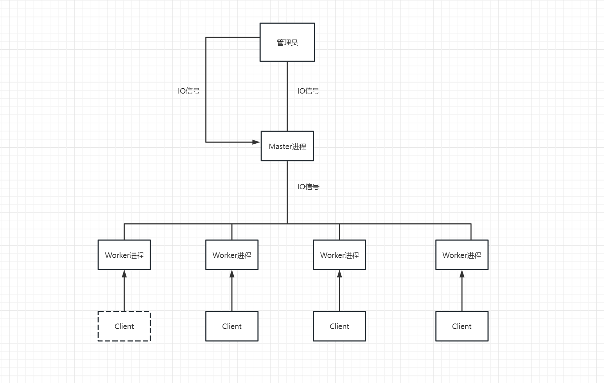

```shell
客户端每进来一个请求，会有一个worker进程，调用io进行处理，如果不能立即得到结果，就去处理其他请求（即为非阻塞），客户端在此期间 也无需等待响应，可以去处理其他事情（即为异步），当io返回时，就会通知此worker进程，暂时挂起当前处理的事务去响应客户端请求。
```

# 正向代理和反向代理

## 正向代理

```shell
正向代理的过程隐藏了真实的请求客户端，服务器不知道真实的客户端是谁，客户端请求的服务都被代理服务器代替请求。
```

## 反向代理

```shell
反向代理的过程隐藏了真实的服务器，客户不知道真正提供服务的人是谁，客户端请求的服务都被代理服务器处理。
```

# Nginx.conf组成

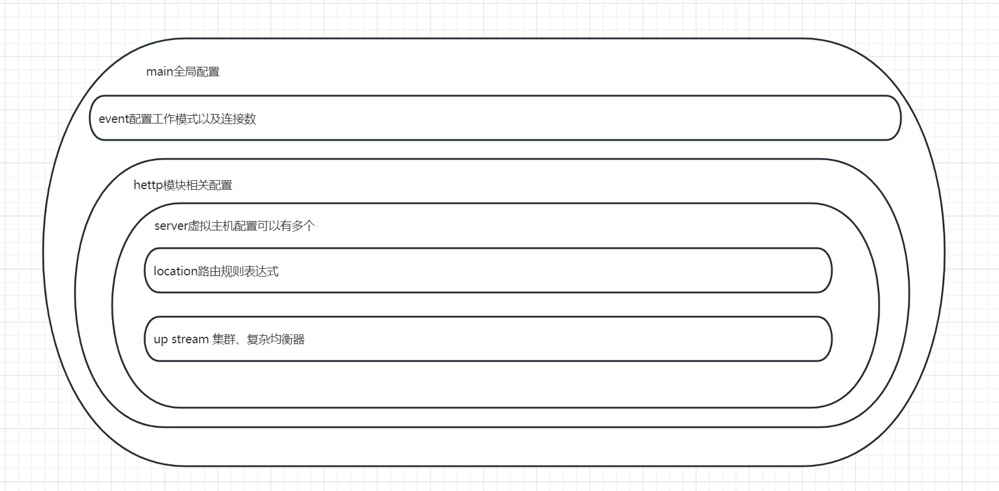

# Nginx虚拟主机配置server

```shell
什么是虚拟主机？："网络空间"，将运行在互联网上的物理服务器划分成多个"虚拟"服务器。
虚拟主机的作用：①方便管理②提高性能③降低成本
基于域名的虚拟主机
基于ip的虚拟主机
基于端口的虚拟主机
```

# Nginx负载均衡配置

```shell
轮询(使用最多)：支持4种负载均衡调度算法。
ip_hash：每个请求按访问IP的hash结果分配，同一个IP客户端固定访问一个后端服务器。
url_hash：按访问url的hash结果来分配请求，使每个url定向到同一个后端服务器。
fair：更加智能的负载均衡算法。必须下载Nginx的 upstream_fair 模块。
```

# nginx配置7层协议及4层协议办法(扩展)

## OSI7层协议

```
记忆口诀：
1、Please Do Not Tell Stupid People Anything
2、All People Seem To Need Data Processing
```

```
应用层(http、https、ssh、ftp)
表示层
会话层
传输层(TCP、UTP)端口
网络层(ICMP)ip地址
数据链路层(ARP)mac地址
物理层
```

```
TCP协议：
TCP协议通过三次握手建立连接，保证数据可靠性。
在文件传输、电子邮件、网页广泛运用。
```

```
UTP协议：
不保证数据包的可靠性，传播的速度快，效率高。
在音频、直播、视频广泛运用。
```

```
ICMP协议：
ping命令发送ICMP回显请求到目标的主机。
```

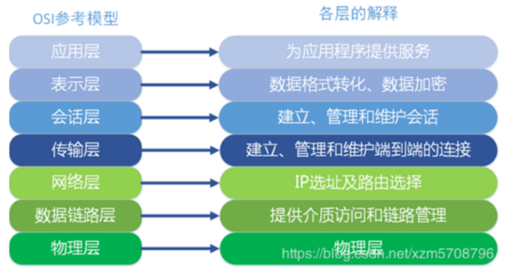

## TCP/IP4层协议

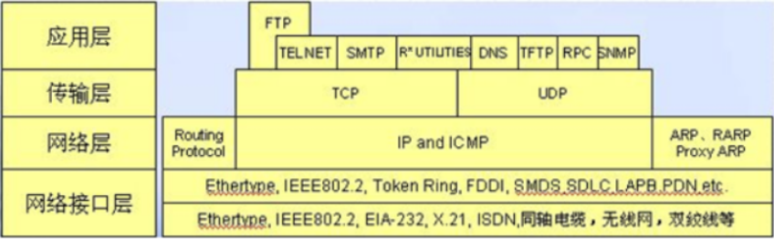

## 协议配置

```shell
nginx工作在4，5，6，7层
区别：见LVS
```

# Nginx会话保持

## ip_hash

```shell
ip_hash使用源地址哈希算法，将同一客户端的请求总是发往同一个后端服务器，除非该服务器不可用。
ip_hash简单易用，但有如下问题： 当后端服务器宕机后，session会话丢失；同一客户端会被转发到同一个后端服务器，可能导致负载失衡。
```

## sticky_cookie_insert

```shell
使用sticky_cookie_insert启用会话亲缘关系，这会导致来自同一客户端的请求被传递到一组服务器的同一台服务器。与ip_hash不同之处在于，它不是基于IP来判断客户端的，而是基于cookie来判断。因此可以避免上述ip_hash中来自同一客户端导致负载失衡的情况。(需要引入第三方模块才能实现)。
```

## jvm_route

```shell
1、一开始请求过来，没有带session信息，jvm_route就根据轮询（round robin）的方法，发到一台 tomcat上面。 
2、tomcat添加上session 信息，并返回给客户。
3、用户再此请求，jvm_route看到session中有后端服务器的名称，它就把请求转到对应的服务器上。
```

# Nginx实现动静分离

```shell
①代理服务器
②静态资源配置
③动态资源配置
```

# Nginx防盗链问题

## 原理

```shell
nginx防止网站资源被盗用模块。referer module后面跟上限制.
```

## 防盗链配置

```shell
none：允许没有http_referer的请求访问资源； 为空则能访问，有值则不能
blocked：允许不是http://开头的，不带协议的请求访问资源---被防火墙过滤掉的
server_names：只允许指定ip/域名来的请求访问资源（白名单）
```

## 目的

```
保护公司网络资源不会被恶意盗链和滥用。比如网站上使用的一些图片和资源，如果不保护，被其他网站盗用，会导致流量的损失、增加服务器压力。
```

# 什么是Rewrite

```shell
URL重写，就是把传入Web的请求重定向到其他URL的过程
```

# rewrite相关指令

## return指令

```shell
last：相当于Apache里的[L]标记，表示完成rewrite。默认为last
break：本条规则匹配完成后，终止匹配，不再匹配后面的规则
```

## redirect

```shell
返回302临时重定向，浏览器地址会显示跳转后的URL地址（不一定）
```

## permanent

```shell
返回301永久重定向，浏览器地址会显示跳转后URL地址
```

# 负载均衡

```shell
配置一台负载均衡器，客户访问服务器，通过负载均衡器分发给不同的服务器，以此减轻服务器的压力。通过添加upstream模块，upsterea负载均衡算法支持轮询，加权轮询，ip_hash, url_hash。
```

# Nginx 的 HTTP 配置主要包括三个区块

```shell
http { 						# 这个是协议级别
　　include mime.types;
　　default_type application/octet-stream;
　　keepalive_timeout 65;
　　gzip on;
　　　　server {			 # 这个是服务级别
　　　　　　listen 80;
　　　　　　server_name localhost;
　　　　　　location / {  # 这个是请求级别
　　　　　　　　root html;
　　　　　　　　index index.html index.htm;
　　　　　　}
　　　   }
}
```

# location前缀含义

```shell
=：表示精确匹配，优先级也是最高的 

~：表示区分大小写的正则匹配  

/：通用匹配，任何请求都会匹配到
```

# location配置示例

```shell
1、没有修饰符表示：必须以指定模式开始
2、=表示：必须与指定的模式精确匹配
3、~ 表示：指定的正则表达式要区分大小写
4、~* 表示：指定的正则表达式不区分大小写
```

# 查找顺序和优先级

```shell
=大于^~大于~|~*|!~|!~*大于/
多个location配置的情况下匹配顺序为：首先匹配=，其次匹配^~, 其次是按正则匹配，最后是交给/通用匹配。当有匹配成功时候，停止匹配，按当前匹配规则处理请求。
================================================
(1) =:表示完全匹配;
(2) ^~:匹配URI的前缀，如果一个URI同时满足两个规则的话，匹配最长的规则;
(3) ~:匹配正则表达式，大小写敏感；
(4) ~*:匹配正则表达式，大小写不敏感；
优先级：（1）> (2) > (3) = (4)
```

```shell
location 区段匹配示例

location = / {
　　# 只匹配 / 的查询.
　　[ configuration A ]
}
location / {
　　# 匹配任何以 / 开始的查询，但是正则表达式与一些较长的字符串将被首先匹配。
　　[ configuration B ]
}
location ^~ /images/ {
　　# 匹配任何以 /images/ 开始的查询并且停止搜索，不检查正则表达式。
　　[ configuration C ]
}
location ~* \.(gif|jpg|jpeg)$ {
　　# 匹配任何以gif, jpg, or jpeg结尾的文件，但是所有 /images/ 目录的请求将在Configuration C中处理。
　　[ configuration D ]
} 
各请求的处理如下例：
	/ → configuration A
	/documents/document.html → configuration B
	/images/1.gif → configuration C
	/documents/1.jpg → configuration D
```

# root、alias指令区别

```shell
location /img {
    alias /var/www/image;
    index index.html;
}

http://192.168.153.231/img  ---> /var/www/image/index.html
#若按照上述配置的话，则访问/img/目录里面的文件时，ningx会自动去/var/www/image/目录找文件
location /img {
    root /var/www/image;
    index index.html;
} 

#若按照这种配置的话，则访问/img/目录下的文件时，nginx会去/var/www/image/img/目录下找文件。
http://192.168.153.231/img  ---> /var/www/image/img/index.html
```

# 为什么要对Nginx进行平滑升级

```shell
随着 nginx 越来越流行，并且 nginx 的优势也越来越明显， nginx 的版本迭代也来时加速模式， 1.9.0版本的nginx更新了许多新功能，伴随着 nginx 的广泛应用，版本升级必然越来越快，线上业务不能停，此时 nginx 的升级就需要平滑升级。
```

# Nginx平滑升级的原理

```shell
（1）在不停掉老进程的情况下，启动新进程。 

（2）老进程负责处理仍然没有处理完的请求，但不再接受处理请求。 

（3）新进程接受新请求。 

（4）老进程处理完所有请求，关闭所有连接后，停止。
```

# 什么是流量控制？

```shell
限制用户在给定时间内HTTP请求的数量，用作安全目的，比如减慢暴力密码破解速率。
```

# 变量的可用性？

```shell
location标签中声明的变量中对这个location块可用
server标签中声明的变量对server块以及server块中的所有子块可用
http标签中声明的变量对http块以及http块中的所有子块可用
```

# http和https区别

```shell
1.安全性不同，Http是超文本传输协议，信息是明文传输，Https则是具有安全性的SSL加密传输协议.
2.响应速度不同，http比https的响应速度更快
3.端口不同http默认访问80端口，https是443端口
4.消耗资源不同，https是构建在SSL之上的http协议，所以https会消耗更多的服务器资源
5.费用不同，https需要购买ssl安全证书，会产生一定的费用
```

# 什么是动静分离？

```shell
把动态页面和静态页面由不同的服务器来解析，加快解析速度。降低服务器的压力。
```

# nginx会话保持是什么概念？

```shell
会话保持是指在“会话”持续或“会话”完成一个任务的时间段内，将客户端请求引导至同一个后端Web服务器。
```

# nginx会话保持的方式有几种？

```shell
Nginx会话保持一般有基于ip_hash和基于cookie两种方式
```

# nginx反向代理和正向代理有什么区别？

```
正向代理：
nginx作为客户端代理请求，访问一些不能直接访问的资源。
例如：企业对外界隐藏的资源，国家对某些网站进行限制，需通过代理服务器访问
反向代理：
nginx作为服务端代理的请求，客户端并不知道真实的服务器，有利于减轻单台服务器的压力，提高系统的可靠性和安全性。
总之：
正向代理用于保护客户端隐私和访问权限，反向代理用于保护服务器隐私和减轻服务器压力。
```

# nginx的gzip压缩有什么作用？怎么做？什么情况下需要压缩？

```
要压缩的原因：
http是明文传输，数据量大，会造成网络传输负载过重，导致页面加载缓慢。

gzip压缩的作用：
压缩数据，有利于减少传输的数据量和时间，提升加载的速度。

原理：
通过压缩算法，将http响应的数据进行压缩，将压缩的数据传给客户端，客户端再进行解压和读取。

怎么做？
要在 Nginx 中启用 gzip 压缩，可以在 Nginx 配置文件中加入以下代码：
gzip on;
gzip_types text/plain text/css application/json application/x-javascript text/xml application/xml application/xml+rss text/javascript;
```

# nginx怎么优化？

```
1、合理配置nginx：
精简配置文件，只保留必要的指令，其他全部扔掉，保证服务器性能。

2、增加缓存：
加钱、可缓存大部分静态资源，提高速度

3、调整work process：
work process决定了nginx能同时处理的连接数。
要是太少，会导致高并发情况下，连接被拒绝。
要是太多，会导致资源浪费。
因此，需要根据实际情况进行及时的调整。

4、使用https加密协议：
有利于保护数据安全，可能会增加服务器的负担，根据实际情况添加。
```

# SSL证书加密访问流程

```
1、客户端向服务端发送https请求

2、服务端收到请求后，向客户端发送server certificate

3、客户端接受到证书之后，会验证这个证书的有效性，生成secret发送给服务端

4、服务端进行secret解密，客户端和服务端使用算法进行通信

5、数据传输完毕后，双方自动断开，释放资源
```

# 7层负载均衡怎么做？

```shell
1、upstream指定服务器。

2、配置server段：
指定所监听的端口号和域名，以及location、proxy_pass选项

3、配置负载均衡策略：
nginx默认的策略是rolad-robin(轮询)，如需要使用其他负载均衡算法，可在upstream设置

4、配置健康检查
健康检查有效避免将请求分发给不同服务器，提高系统可用性。可以通过health_check进行健康检查
```


~~~shell
1. 安装Nginx并配置反向代理。假设我们有3个web服务器，可以在Nginx中配置upstream来指向这3个服务器：

```
upstream backend {
    server 192.168.0.1;
    server 192.168.0.2;
    server 192.168.0.3;
}
```

2. 配置server段。在Nginx的server段中，我们可以指定监听的端口号和域名，以及对应的location和proxy_pass选项：

```
http {
    server {
        listen 80;
        server_name example.com;

        location / {
            proxy_pass http://backend;
        }
    }
}
```

3. 配置负载均衡策略。Nginx默认的负载均衡策略是轮询（round-robin），即每个请求依次分发给后端服务器。如果需要使用其他负载均衡算法，可以在upstream中设置。例如，我们可以使用IP hash算法，将同一个IP的请求固定分发到同一台服务器：

```
upstream backend {
    ip_hash;
    server 192.168.0.1;
    server 192.168.0.2;
    server 192.168.0.3;
}
```

4. 配置健康检查。健康检查可以有效地避免将请求分发给不可用的服务器，提高系统的可用性。在Nginx中，我们可以通过设置health_check选项来实现健康检查。例如，以下配置将每5秒对每个后端服务器的/health接口进行一次健康检查：

```
upstream backend {
    server 192.168.0.1:8080;
    server 192.168.0.2:8080;
    server 192.168.0.3:8080;

    health_check interval=5s;
}
```
~~~

# nginx的隐藏版本号是什么？

```
隐藏在http响应头中的nginx服务器版本号的做法。
作用：
增加服务器安全性，减少被攻击的风险。
```

# 动态请求和静态请求有什么区别？

```
动态请求：跟数据库有交互的请求，服务器根据客户端的请求，返回给客户端的资源。
例如：php

静态请求：跟数据库无交互的请求，客户端请求的资源已经在服务器上了。
例如：html、JavaScript

动态请求需要根据客户端的请求，返回给客户端资源，所以响应的速度慢一些。动态请求需要更高配置的服务器和复杂的逻辑代码。
```

# 访问nginx程序比较慢，怎么去处理？

```http
一台服务器比较卡，应该怎么去做？
```


```
top查看cpu和内存使用率、杀死不用的进程

1、资源不足：
服务器配置低或访问量大，导致资源不足。应当升级或扩容服务器。

2、DNS解析时间长：
将DNS解析结果缓存到本地，或用快速的DNS服务器

3、I/O速度慢：
使用SSD高速磁盘

4、nginx配置问题：
worker_connections过小、keepalive_timeout时间过长

5、网络延迟
```

# nginx优化参数有哪些？哪些模块有哪些作用？

```
参数优化：
1、worker_processes：
指定worker进程数，建议cpu核数
2、worker_connections：
worker进程最大连接数，建议设为1024
3、keepalived_timeout：
http keepalived最大并发连接数。在高并发场景可设置几秒或更长的时间。

常用模块：
1、rewrite：
地址重写
2、proxy：
反向代理，转发客户端请求到后端服务器
3、upstream：
后端服务器分组，实现负载均衡和高可用
4、gzip：
数据压缩，减少网络传输量，提高响应速度
5、access.log
记录客户端请求日志
```

# 单向认证流程(RSA)

`单向认证`流程中，服务器端保存着公钥证书和私钥两个文件，整个握手过程如下：

[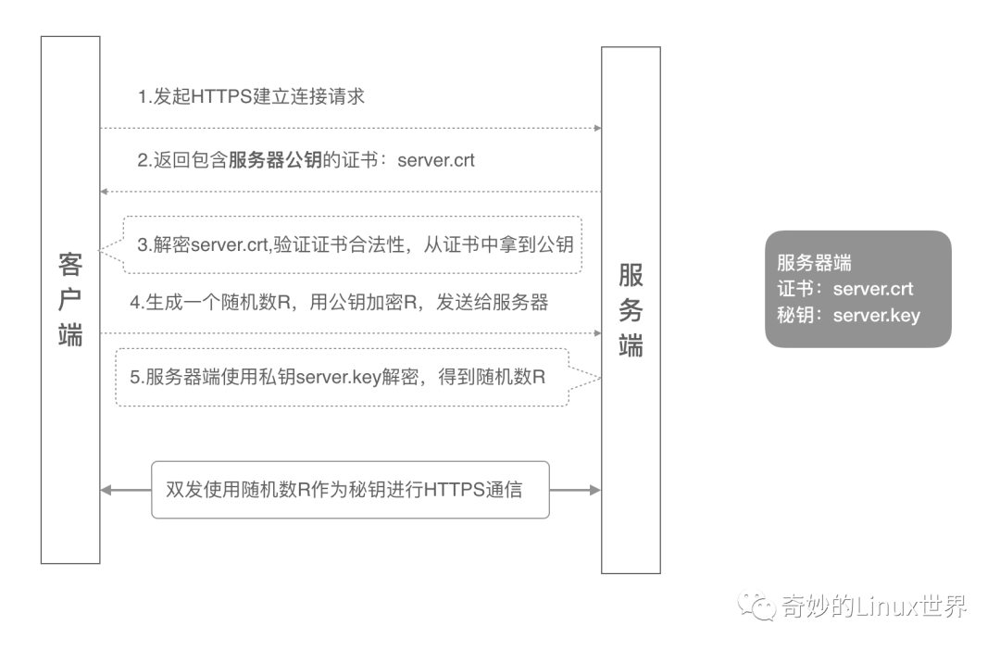](https://hjk.life/assets/img/2021-01-22-mutual-authentication/单向认证.png)

1. 客户端发起建立 HTTPS 连接请求，将 SSL 协议版本的信息发送给服务器端；
2. 服务器端将本机的公钥证书（server.crt）发送给客户端；
3. 客户端读取公钥证书 (server.crt)，取出了服务端公钥；
4. 客户端生成一个随机数（密钥 R），用刚才得到的服务器公钥去加密这个随机数形成密文，发送给服务端；
5. 服务端用自己的私钥 (server.key) 去解密这个密文，得到了密钥 R
6. 服务端和客户端在后续通讯过程中就使用这个密钥R进行通信了

# 双向认证流程(RSA)

[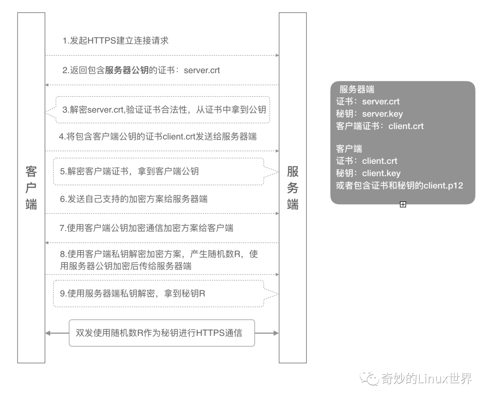](https://hjk.life/assets/img/2021-01-22-mutual-authentication/双向认证.png)

1. 客户端发起建立 HTTPS 连接请求，将 SSL 协议版本的信息发送给服务端；
2. 服务器端将本机的公钥证书 (server.crt) 发送给客户端；
3. 客户端读取公钥证书 (server.crt)，取出了服务端公钥；
4. 客户端将客户端公钥证书 (client.crt) 发送给服务器端；
5. 服务器端解密客户端公钥证书，拿到客户端公钥；
6. 客户端发送自己支持的加密方案给服务器端；
7. 服务器端根据自己和客户端的能力，选择一个双方都能接受的加密方案，使用客户端的公钥加密后发送给客户端；
8. 客户端使用自己的私钥解密加密方案，生成一个随机数 R，使用服务器公钥加密后传给服务器端；
9. 服务端用自己的私钥去解密这个密文，得到了密钥 R
10. 服务端和客户端在后续通讯过程中就使用这个密钥R进行通信了。

# Nginx有哪些应用场景

Nginx的主要使用场景我归纳为三个，分为是静态资源服务、代理资源服务、安全服务

> 网站基本架构，提供基本的数据功能

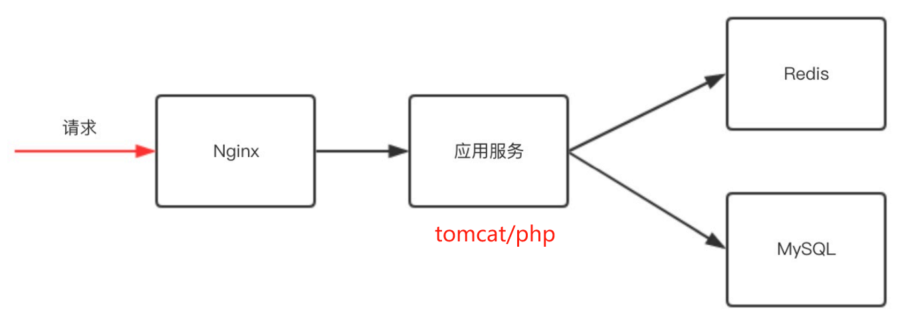

nginx具有反向代理功能，这样可以将动态请求传倒给集群服务

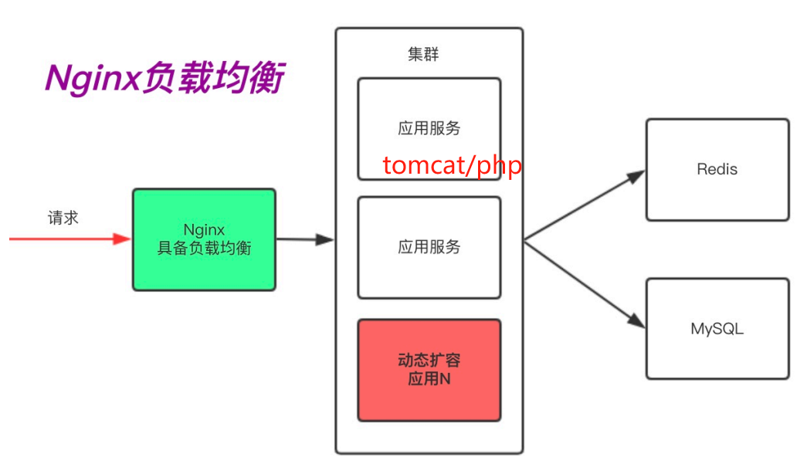

随着我们网络链路的增长，用户体验到的时延则会增加。如果我们能把一段时间内不会发生变化的"动态"内容，缓存在Nginx，由Nginx直接向用户提供访问，那么这样用户请求的时延就会减少很多，所以在这里反向代理会演生出另外一个功能"缓存"，因为它能加速我们的访问

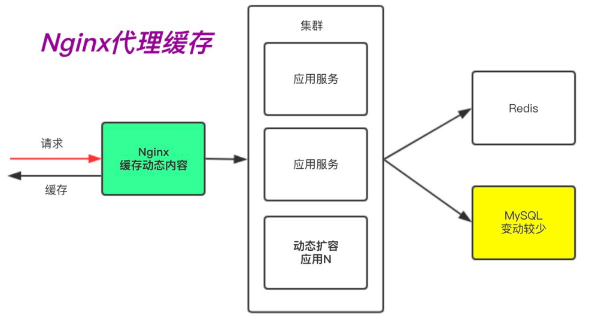

在很多时候我们访问docs、pdf、mp4、png等这样的静态资源时，是没有必要将这些请求通过Nginx交给后端的应用服务，我们只需要通过Nginx直接处理“静态资源”即可。这是Nginx的静态资源功能

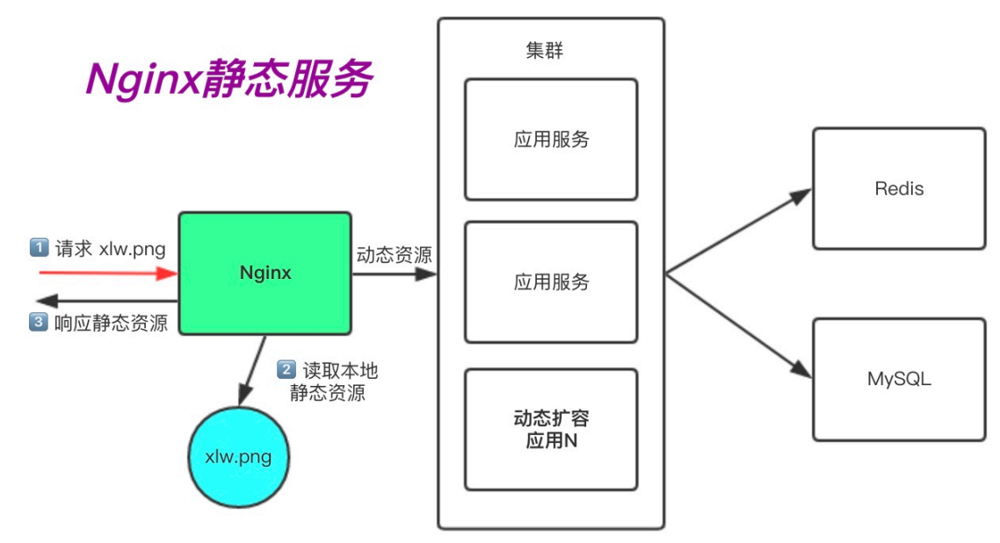

当我们使用http网站时，可能会遭到劫持和篡改，如果使用https安全通讯协议，那么数据在传输过程中是加密的，从而能有效的避免黑客窃取或者篡改数据信息，同时也能避免网站在传输过程中的信息泄露。大大的提升我们网站安全

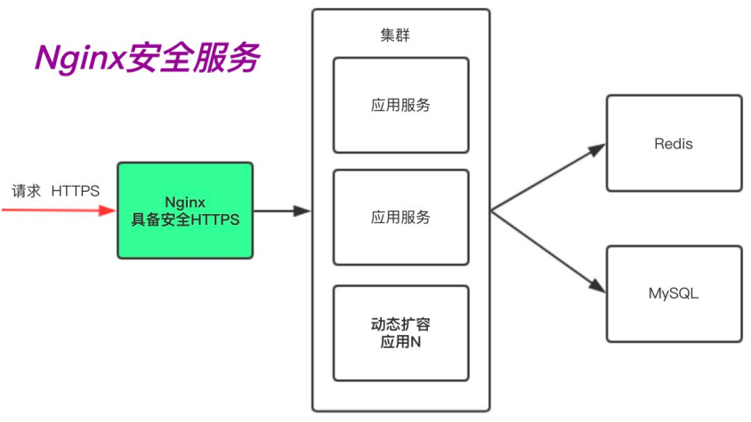

# Nginx的组成部分有哪些？

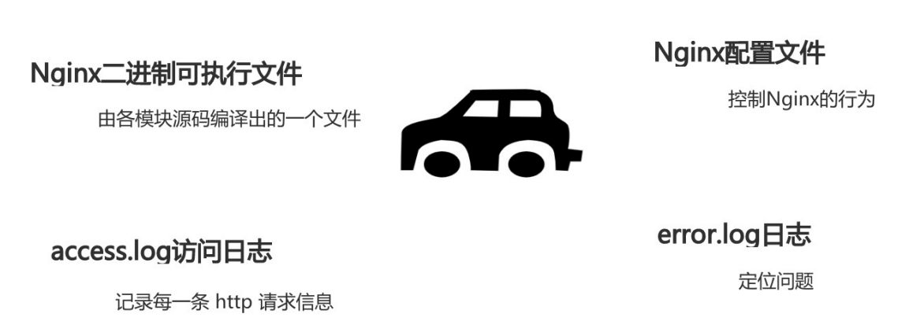

# Nginx中的http、server、location之间的关系是？

> http标签主要用来解决用户的请求与响应
>
> server标签主要用来响应具体的某一个网站
>
> location标签丰要用于匹配网站具体URL路径
>
> http{}} 层下允许有多个Server{}}，一个Server{}}下又允许有多个location{}

# Nginx配置虚拟主机有哪些方式？

方式一、基于主机多IP方式
方式二、基于端口的配置方式
方式三、基于多个hosts名称方式(多域名方式)

# Nginx有哪些常用的模块？

> Nginx目录索引模块
>
> Nginx访问控制模块(用户名和密码认证)

> Nginx流量控制
>
> 限制单位时间内所产生的http请求数
>
> 限制客户端同一时刻的并发连接数
>
> 限制下载速度

> Nginx状态监控

> Nginx Location

| 匹配符 | 匹配规则                     | 优先级 |
| ------ | ---------------------------- | ------ |
| =      | 精确匹配                     | 1      |
| ^~     | 以某个字符串开头             | 2      |
| ~      | 区分大小写的正则匹配         | 3      |
| ~*     | 不区分大小写的正则匹配       | 4      |
| /      | 通用匹配，任何请求都会匹配到 | 5      |

# LNMP实现过程

用户请求 http://example.com/index.php ，对于Nginx服务而言，是无法处理 index.php 这样的动态脚本的，那么 Nginx 该如何配置，才能支持这样的动态请求呢?

> 第一步:当用户发起 HTTP 请求，请求首先被 Nginx 接收;
>
> 第二步: Nginx 通过预先定义好的 location 规则进行匹配;
>
> 第三步:Nginx将匹配到的动态内容，通过 fastcgi 协议传到给后端的 php 应用服务处理


# LNMP实现的细节

Nginx、PHP、MySQL 之间是如何工作的

> 1.用户首先通过 http 协议发起请求，请求会先抵达 Nginx;
>
> 2.Nginx 根据用户的请求进行 Location 规则匹配;
>
> 3.Location 如果匹配到请求是静态，则由 Nginx 读取本地直接返回;
>
> 4.Location 如果匹配到请求是动态，则由 Nginx 将请求转发给 fastcgi 协议;
>
> 5.fastgi 收到后会将请求交给 php-fpm 管理进程;
>
> 6.php-fpm 管理进程接收到后会调用具体的工作进程 warrap
>
> 7.warrap 进程会调用 php 解析器解析代码， php 解析后直接返回
>
> 8.如果有查询数据库操作，则由 php 连接数据库(用户 密码 IP)发起查询的操作
>
> 9.最终数据由 mysql->php->php-fpm->fastcgi->nginx->http->user


# 为何要拆分数据库？

由于单台服务器运行 LNMP 架构会导致网站访问缓慢，:当系统内存被吃满时，很容易导致系统出现 oom ，从而 ki11 掉 MySQL 数据库，所以需要将 web 和数据库进行独立部署。

拆分数据库能解决什么问题？

> 1.缓解 web 网站的压力;
> 2.增强数据库读写性能;
> 3.提高用户访问的速度;

数据库拆分架构演变


# 为何要扩展多 台web节点？

单台 web 服务器能抗住的访问量是有限的，配置多台 web 服务器能提升更高的访问速度。

扩展多台节点解决什么问题？

> 1.单台 web 节点如果故障，会导致业务 down 机;
>
> 2.多台 web 节点能保证业务的持续稳定，扩展性高!
>
> 3.多台 web 节点能有效的提升用户访问网站的速度

扩展多web节点架构演变


# 分为要拆分静态资源？

当后端的 web节点出现多台时，会导致用户上传的图片、视频附件等内容仅上传至一台web 服务器，那么其他的 web 服务器则无法访问到该图片

如果增加一台共享存储能解决什么问题

> 1.保证了多台 web 节点静态资源一致。
>
> 2.有效节省多台 web 节点的存储空间。
>
> 3.统一管理静态资源，便于后期推送至 CDN 进行静态资源加速

拆分静态资源架构演变


# 现在有多个WEB服务器，该如何进行访问?

1.DNS轮询

> 1、需要所有的web节点具备公网IP地址
>
> 2、公网独立IP需要费用，而且不便宜
>
> 3、所有的web节点有公网IP，不安全
>
> 4、DNS只有轮询机制，没有健康检查功能

2、负载均衡

> 1、所有的web节点不需要有公网IP，能节省成本、并保证安全
>
> 2、能够对后端的web节点进行健康检查机制;
>
> 3、负载均衡有多种调度算法来满足企业不同需求:


# Nginx代理服务常见的模式有哪些？

那Nginx作为代理服务,按照应用场景模式进行总结，代理分为正向代理、反向代理

### 正向代理

> 正向代理，(内部上网) 客户端<-->代理->服务端


1、客户端翻墙


2、客户端提速


3、客户端缓存

比如:下载资源，可以先查看代理服务是否有，如果有直接通过代理获取


4、客户端授权

很多公司为了安全，连接外网需要通过防火墙，防火墙可以配置规则，允许谁可以上外网，谁不可以上外网。


### 反向代理

反向代理，用于公司集群架构中，客户端->代理<-->服务端


1、路由功能

根据用户请求的URI调度到不同的功能的服务器进行处理


2、负载均衡

将用户发送的请求，通过负载均衡调度算法挑选一台合适的节点进行请求处理。


3、动静分离

根据用户请求的URI进行区分，将动态资源调度至应用服务器处理，将静态资源调度至静态资源服务器处理。


4、数据缓存

将后端查询的数据存储至反向代理上缓存，可以加速用户获取资源。


# 正向代理与反向代理的区别？

> 区别在于形式上服务的"对象"不一样、其次架设的位置点不一样
>
> 正向代理代理的对象是客户端，为客户端服务
>
> 反向代理代理的对象是服务端、，为服务端服务

# Nginx代理服务支持协议有哪些？

Nginx作为代理服务，支持的代理协议非常的多，具体如下图


通常情况下，我们将Nginx作为反向代理，常常会用到如下几种代理协议


# 什么是负载均衡？

负载均衡 Load Balance指的是将用户访问请求所产生的流量，进行平衡，分摊到多个应用节点处理。

负载均衡扩展了应用的服务能力，增强了应用的可用性。

# 为什么需要负载均衡？

当我们的 web 服务器直接面向用户，往往要承载大量并发请求，单台服务器难以负荷，我使用多台 WEB 服务器组成集群，前端使用 Nginx 负载均衡，将请求分散的打到我们的后端服务器集群中，实现负载的流量分发。从而提升整体性能、以及系统的容灾能力。


# 负载均衡与代理的区别是什么？

Nginx 负载均衡与 Nginx 反向代理不同地方在于：

> Nginx 代理仅代理一台服务器。
>
> Nginx 负载均衡则是将客户端请求通过 proxy_pass 代理至一组 upstream
> 资源池。

# Nginx负载均衡应用场景有哪些？

1、四层负载均衡

四层负载均衡指的是 0SI 七层模型中的传输层，四层仅需要对客户端的请求进行 TCP/IP 协议的包转发就可以实现负载均衡。

四层负载均衡的性能极好、因为只需要底层进行转发处理，而不需要进行一些复杂的逻辑


2、七层负载均衡

七层负载均衡工作在应用层，它可以完成很多应用方面的协议请求，比如我们说的 http 应用负载均衡，它可以实现 http 头信息的改写、安全应用规则控制、 URI 匹配规则控制、及rewrite 等功能，所以在应用层里面可以做的内容就更多了


# 四层负载均衡与七层负载均衡的区别？

> 四层负载均衡:传输层

优点:性能高，数据包在底层就进行了转发

缺点:仅支持 ip:prot 转发，无法完成复杂的业务逻辑应用

> 七层负载均衡:应用层

优点:贴近业务，支持 URI路径匹配、Header 改写、 Rewrite 等

缺点:性能低，数据包需要拆解到顶层才进行转发

# Nginx负载均衡配置的场景有哪些？

Nginx实现负载均衡需要两个模块：

> proxy_pass代理模块
>
> upstream虚拟资源池模块

负载均衡场景架构图


# Nginx负载均衡调度算法有哪些？

> 轮询：按时间顺序逐一分配到不同的后端服务器(默认)
>
> weight：加权轮询,weight值越大,分配到的访问几率越高
>
> ip_hash：每个请求按访问IP的hash结果分配,这样来自同一IP的固定访问一个后端服务
> 器
>
> least_conn：将请求传递到活动连接数最少的服务器。

1、轮询调度算法

将每一次用户的请求，轮流分配给内部中的服务器。

轮询算法的优点是其简洁性，它无需记录当前所有连接的状态，所以它是一种无状态调度。

2、weight

根据服务器的不同处理能力，给每个服务器分配不同的权值，使其能够接受相应权值数的服务请求。

3、ip_hash调度算法

ip_hash 是基于用户请求的 IP ，对该 IP 进行 hash 运算，根据 hash 运算的值，将请求分配到后端特定的一台节点进行处理。ip_hash 算法实现公式:hash(ip)%node_ counts = index


ip_hash 调度算法会带来两个问题

1.如果有大量来自于同一IP的请求会造成某个后端节点流量过大，而其他节点无流量

2.如果临时下线一台节点，会出现重新计算 hash 值，官方建议将下线节点标记为down 状态，以保留客户端 IP 地址的当前哈希值。


如果有大量的用户调度到某一节点，而该节点刚好故障，则该算法会重新计算结果，从而造成大量的用户被转移其他节点处理，而需要重新建立会话。

4、一致性哈希算法

为了规避上述 hash 情况，一致性 hash 算法就诞生，一致性 Hash 算法也是使用取模的方法,但不是对服务器节点数量进行取模，而是对 2的32方 取模。即，一致性 Hash 算法将整个 Hash 空间组织成一个虚拟的圆环， Hash 函数值的空间为0~2^32-1

5、url_hash调度算法

根据用户请求的 URL 进行 hash 取模，根据 hash 运算的值，将请求分配到后端特定的一台节点进行处理。 URL算法使用场景如下:client-->nginx-->url_hash-->cache1-->app

> 1.用户请求 nginx 负载均衡器，通过 ur1 调度算法，将请求调度至 cache1
>
> 2.由于 cache1 节点没有对应的缓存数据，则会请求后端获取，然后返回数据，并将数据缓起来；
>
> 3.当其他用户再次请求此前相同的 URL 时，此时调度器依然会调度至 cache1 节点处理;
>
> 4.由于 cache1 节点已存在该 URL 资源缓存，所以直接将缓存数据进行返回;能大幅提升网站的响应;

6、least_conn

least conn调度算法实现原理，哪台节点连接数少，则将请求调度至哪台节点。

# Nginx负载均衡后端状态有哪些？

后端 web 节点在前端 Nginx 负载均衡调度中的状态

| 状态         | 概述                             |
| ------------ | -------------------------------- |
| down         | 当前的server暂时不参与负载均衡   |
| backup       | 预留的备份服务器                 |
| max_fails    | 允许请求失败的次数               |
| fail_timeout | 经过max fails失败后,服务暂停时间 |
| max_conns    | 限制最大的接收连接数             |

> max_conns限制连接数

max_conns 用来限制每个后端节点能够接收的最大TCP连接数，如果超过此连接则会抛出错误。

> down标识关闭状态

down 将服务器标记为不可用状态

> backup标识备份状态

backup 将服务器标记为备份服务器。当主服务器不可用时，将请求传递至备份服务器处理。

> max fails与fail timeout

max fails=2 服务器通信失败尝试2次，任然失败，认为服务器不可用;

fail_timeout=5s 服务器通信失败后，每5s探测一次节点是否恢复可用；

在 fail timeout 设定的时间内，与服务器连接失败达到 max fails 则认为服务器不可用;

# 什么是会话保持？

当用户登陆一个网站服务器，网站服务器会将用户的登陆信息存储下来(存储下来的内容叫Session )，以保证我们能够一直处于“登陆在线“状态。

# 为什么需要会话保持？

由于我们使用的是负载均衡轮询机制，会导致用户请求分散在不同的节点，从而造成会话无法保持。

假设用户A，通过负载均衡登陆了网站，此时会话信息存储在A节点，那么当它一刷新，负载均衡会将请求分发给B节点，那么B节点没有用户A的登陆信息，就会提示用户A登陆，当A用户点击登陆时又会将请求分发给C节点，从而造成用户A无法实现会话保持。

# 如何实现会话保持？

1.粘性session:指Ngnix每次都将同一用户的所有请求转发至同一台服务器上，及Nginx的IP hash.

2.session复制:每次session发生变化，就广播给集群中的服务器，使所有的服务器上的session相同。

3.session共享:缓存session至内存数据库中，使用redis，memcached实现。

4.session持久化:将session存储至数据库中，像操作数据一样操作session。
