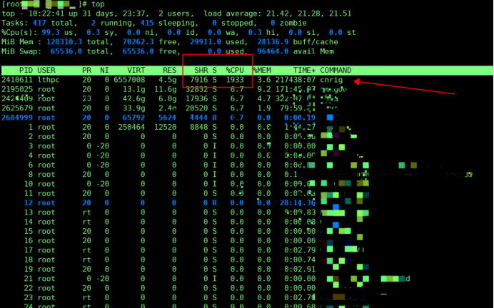

# 公司有几台gitlab？

```
1台4核16G 512G
```

# jenkins配置多少？

```
4核16G 512G
```

# 公司有几台Mysql？配置什么样的？

```
10台mysql、2核四G、1T内存
```

# Nginx配置多少？

```
2核4G 200G
```

# Python用的是什么版本？

```
3.6.8
```

# redis什么配置？

```
4核 32G 100G
```

# tomcat配置多少？

```
公司一般为4核8g，32g的磁盘
```

# 监控多少个监控端？

```
1000~2000个监控
```

# 常用服务版本及端口以及开发语言

```shell
服务              端口             开发语言                   版本
nginx             80                C                      1.18
tomcat       8080，8005，8009      java                     8.54
mysql            3306               C                      5.7.27
redis            6379               C                      4.0.9
zabbix           10050              C                       5.0
jenkins          8080             java                     2.346
jdk(java)                                                   1.8
ansible           22             python                    2.927
kafka            9092             scala                    2.11
elasticsearch    9200             java                     6.5.4
logstash         9300             jruby                    6.5.4
filebeat     没端口看日志进程         go                      6.5.4
kibana           5601         html&javascript              6.5.4
docker       无端口查看服务           go                     1.23.1
kunbernets                          go                     1.19
FTP               21                                             
SSH               22
prometheus       9090                                       2.31
node_exporter    9100                                       1.2.2
grafana          3000                                       6.4.3
--------------------------------------------------------------------
Rabbitmq
4369 -- erlang端口
5672 --程序连接端口
15672 -- 管理界面ui端口
25672 -- server间内部通信端口
```


# jenkins编译打包工具？哪个版本？

```
meaven 3.7版本
```

# 挖矿病毒

```
1. Top发现挖矿病毒
中毒挖矿的特征：服务器比较卡，top查看，内存和CPU占用都比较高

2. 根据PID查找进程，回显记录下来了，当时没有截图
```



```
3. 看到这是lthpc这个用户起来的程序，因为服务器是购买的联泰集群，装机会默认创建这个用户，UID一般为1000 而且所有联泰集群服务器的这个用户默认密码都是Lt111111
（现在的怀疑黑客是通过这个用户进来的，反正给领导是这么汇报的）

4. 查找到进程后第一步就是kill杀死这个进程，然后这个挖矿脚本一般会存在/var/tmp下，但是当时查找没有找到。

5. 一般的挖矿病毒都会设置定时任务，通过crontab -l查看定时任务，没有找到，然后在/etc/cron.d/下也没有找到。

6. 因为我是用root用户去查看的crontab 这个是看不到其他用户创建的定时任务的，想要查看其他用户的定时任务可以进入到 /var/spool/cron

7. lthpc用户创建的定时任务就在这里了，当时着急了没有看里面内容，直接就删除了。

8. 最后使用find / -name cnrig 查找到了此脚本在/var/tmp/下有一个隐藏文件.ap
Cd /var/tmp/ 进入到目录下

9. 然后执行ll -a 查看到了隐藏文件，接着进到这个隐藏文件下，发现新天地了
```


```
当时没有经验，直接就删除了，以至于现在想看到底咋回事都无从下手了...

小结：删除所有无关用户，修改所有用户密码，增加密码强度，开启防火墙。
```


# 公司有多少台机器？虚拟机还是服务器？

```
生产环境30台机器，测试环境30台机器
一个物理机能虚拟10~15个Linux服务器
戴尔740
```


# 公司有多少台虚拟机、你负责多少台虚拟机，具体怎么规划

# 现在给你三百台服务器，你怎么对他们进行管理？

```
1、使用jumpserver，使用统一的账号去登陆，便于安全性的管理
2、使用ansible进行系统的管理与配置
```


# 上家公司是做什么的？接什么外包的项目？

```
自研项目：大活网络、心跳互娱APP、文化会展智能化远程监控系统、物联网投屏多媒体交互平台等
外包项目：微信小程序，校园跑腿外卖小程序、电动车充电的小程序、应急环保门禁管控系统等
其他：广告设计、影视制作、计算机系统开发与咨询
```

# 运维有多少人？三个人的分工都是什么？

```
加上我有2.5个运维
我负责服务器搭建、环境部署、监控、代码发布上线、协助实施运维安装一些设备
0.5：开发人员负责写一些Python脚本，方便我去调用钉钉报警，或者利用算法调用远程监控设备等
实施运维：负责出差跑业务的，有时候也会喊上我一起去，协助实施运维做好项目
```


# 小程序每天的访问量是多少？

```
2000~3000，并发量几百
```


# 访问量产生的日志是多大？

```
5~6M
```


# 磁盘有多大？

```
Gitlab：512G
Jenkins：512G
Mysql：1T
Tomxcat：32G磁盘
```


# PV和UV什么意思？什么关系？

# 为什么离职？

```
合同到期了，亲戚在上海，想去上海发展
```


# zabbix每天产生的监控数据有多大？怎么去处理？多长会满？

```

```


# Tomcat每天的日志有多少？

```
有5~6M左右
```

# 用户怎么去用？网站上有什么功能？

# 小程序是做什么的？上面都有什么功能啊？

# 你在这个项目中，都是负责什么样的内容？

# 你都用过什么？

# Jenkins有多少个项目需要构建？都是什么项目？

# 你在上家公司所擅长运维方面的技术有哪些？

# 上家公司用的什么云？

```
阿里云
```


# 机房什么类型服务器？

```
刀片式服务器：
紧凑、轻便服务器，有后备电源和冷却系统，可以手动配置，插入和移动
```

# 物理机的用途是什么？

```
物理机是独立的硬件设备 ，用于托管应用程序、数据存储。物理机有高性能，满足大量的计算和存储
物理机和虚拟机的对比？
物理机提供更加直接的访问控制、更加直接的性能监控、本地存储的优势
```

# 你们公司物理机大概有多少？

```
8台物理机，我负责其中5台，我们公司目前有4个项目，我负责2个项目
```


# 在公司的日常工作是什么？                 

# 怎么用Jumpserver？

