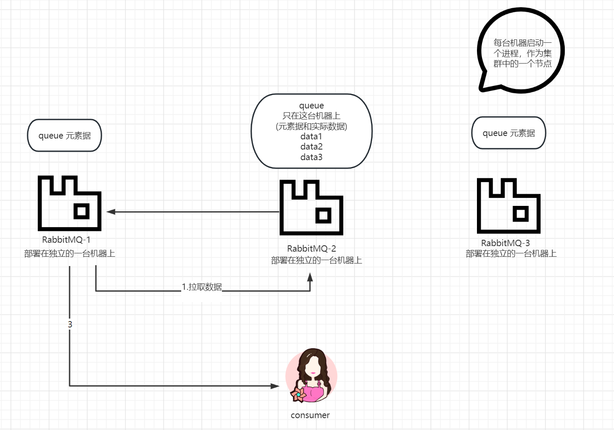
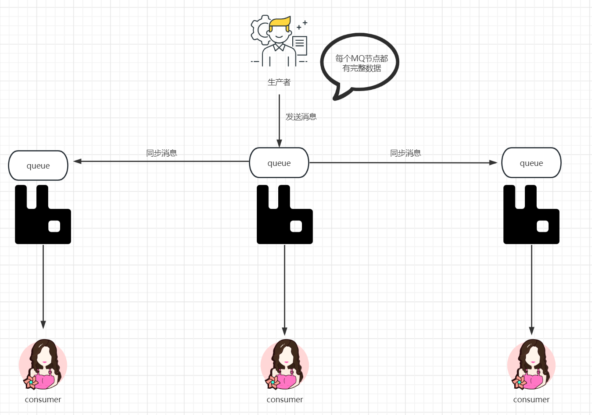

# 消息队列的作用？

```
1、储存和传递消息
producer发消息给队列，这个消息会存储在队列中。
consumer从队列中读取消息
解决producer和consumer数据异步传输问题

2、消息的持久化
Rabbitmq宕机，消息队列的消息还可以被comsumer读取

消息队列支持处理高并发、大量数据的场景，提高系统稳定
```

# Rabbitmq和kafka的区别？

```
1、设计目标：
Rabbitmq将消息传输到不同应用程序
kafka分布式流数据平台，适合实时数据流处理

2、性能：
kafka处理大量数据比rabbitmq更具优势
rabbitmq处理消息更稳定

3、可靠性：
rabbitmq有消息队列，数据传输可靠
kafka注重实时性和吞吐量，适用于对消息处理速度要求高的场景
```

# Rabbitmq的集群模式和镜像模式有什么区别？

```
共性：
提高系统可用性和负载均衡

区别：
实现机制的不同
集群模式：通过多个节点进行数据分散处理提高系统可用性(无高可用性)
镜像模式：通过将队列中的数据复制到多个节点上保证高可用性
```

## 集群模式




## 镜像模式


