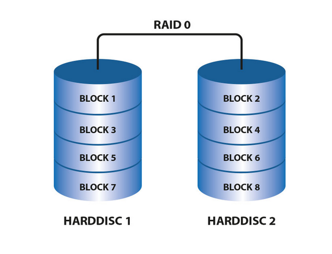
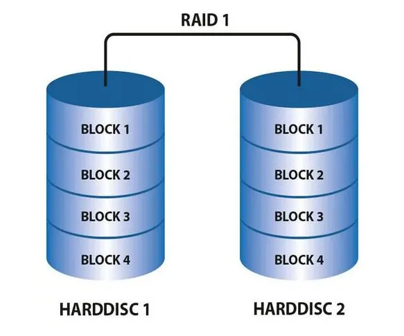
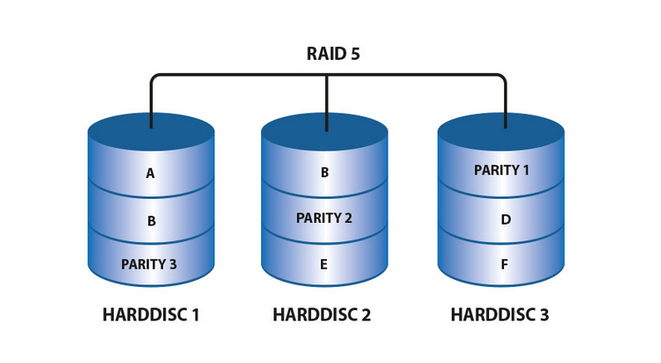
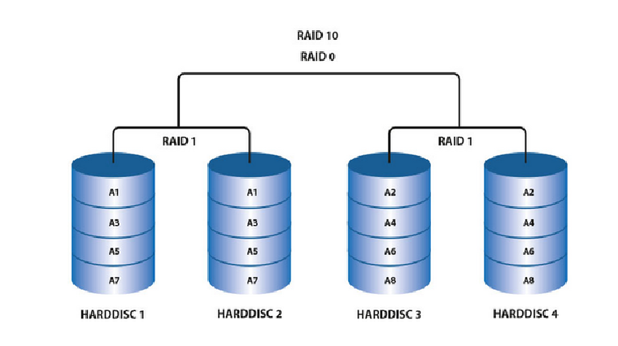
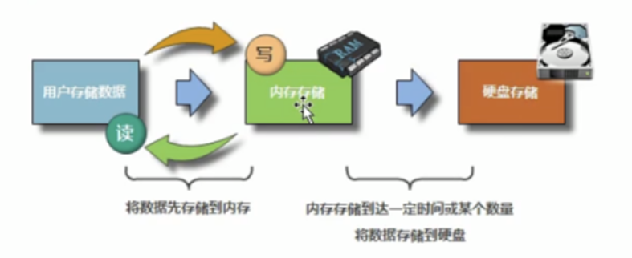
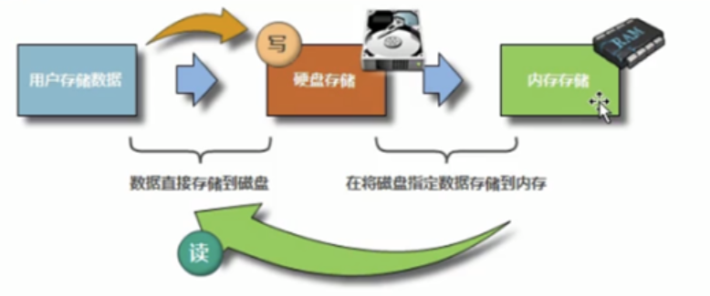

# 如何稳定的管理服务器

`物理方面`

1.重要的服务器使用双电源。

2.每个电源接不同的线路。

3.做同样服务的服务器要至少两台(灾备)。

4.不同的机房放置服务器，不同的地区放置服务器(2地3中心)。

# 内存

1.临时存储器，关机数据丢失。

2.存放着运行的数据【进程】。

3.内存(RAM)是cpu和磁盘之间的缓冲设备。

# 硬盘

1.永久存储器，永久存放数据。

2.存放各类程序、文件、视频。

3.接口类型SAS、SATA、M.2、PCI-E。

4.机械硬盘(慢)和固态盘SSD(快)(电子)

# 服务器优化的核心

1.选择用固态盘，raid10

2.把磁盘的数据往内存里放，再给用户访问

3.对于企业高并发网站来讲，都会尽量让用户从内存中读写数据，而不是硬盘。

4.企业服务器、网站优化的核心，都是调整用户访问磁盘和内存之间的比例。

# 计算机与服务器各硬件I/O对比

I/O即input/output输入/输出，一般翻译为读写。

衡量磁盘读写速度的单位是iops，即input/output per second(每秒的输入与输出)。

1s=1000ms（毫秒）=1000 000us(微秒)=1000 000 000ns(纳秒)

# Raid卡(阵列卡)

1.把多块盘组合成一块。

2.冗余的作用

3.提供不同的访问效率（Raid级别：raid0、raid1、raid5、raid10）

```
软raid不花钱，性能差，有风险
优点：免费
缺点：1.支持raid0和raid1级别。2.性能差。3.系统坏数据可能丢失
```

```
硬raid分为两种：服务器板载、独立raid卡
优点：1.支持更多的raid级别2.性能好3.系统坏数据提前设置好的可恢复
```

### raid0：是多块磁盘组合成一个

**特征**

```
1.容量是多盘之和
2.没有冗余
3.效率提高一倍
```

**应用场景**

```
1.数据不重要
2.高并发访问环境
```



### raid1：镜像盘

**特征**

```
1.容量是单个最小盘的容量
2.百分百冗余
3.性能较弱
```

**应用场景**

```
1.数据重要但对性能要求不高。系统盘，数据库
2.灾备
```



### raid5：将性能、安全、成本都兼顾

```
RAID5把校验码信息分布到各个磁盘上。
RAID5最少需要三块磁盘来组建磁盘阵列，允许最多同时坏一块磁盘。要是两块磁盘坏了，数据无法恢复。
```



### raid10：兼顾raid1和raid0优点

```
优点：
RAID1同时写双份无差别数据到工作盘和镜像盘起到了数据保障的作用。且在每一份磁盘上又会使用RAID0的技术将数据分为N份，在N块磁盘进行读写，N份数据同时写到磁盘中，性能高。
缺点：
RAID10有一半的磁盘空间用于存储冗余数据的，浪费的很严重。
```



# 远程管理卡

当服务器连不上的时候，可以通过远程管理卡启动查看

# 计算机数据单位

1bit=一个二进制位(0/1)

1Bytes=8bit

1KB=1024B

1MB=1024KB

1GB=1024MB

1TB=1024GB

1PB=1024TB

100M带宽是小b(bit)

速率100M/8=12.5MB

# 硬件补充知识

物理结构分为：机械硬盘、固态硬盘

接口类型分为：sata、sas、m.2、pci-e

按速度：pci-e > m.2 > 普通固态ssd > sas接口 > sata接口

# IDC机房个机柜的知识

机房为企业提供存放服务器的空间和提供大量带宽，带宽分为单线带宽和多线(BGP线路)带宽

联通、移动、电信、教育、广电、铁通。不同线路之间的通信很慢

单线：1M/30元，只有某一个线路，比如联通，做CDN服务的企业，或CDN服务器的企业

多线(BGP线路)：4 线联通、移动、电信、教育，1M/120-300元

企业多数都会买BGP机房

```
CDN服务器，全称为Content Delivery Network，即内容分发网络。它是构建在互联网上的一种网络技术，旨在通过在全球范围内设置多个服务器节点，将用户请求的数据分发到离用户最近的服务器上，以此快速响应用户的请求并提高用户体验。CDN的主要作用是减轻源站的压力、提高用户访问速度、增强网站的稳定性，并通过多节点分发提高网站的容错能力和可靠性。
```

# 运维人员的三大核心工作职责是什么?

1.数据安全

2.永远不宕机

3.用户体验好

# 程序、进程和守护进程有什么区别?

程序放在磁盘里的文件

进程是内存中运行的

一直运行的就是守护进程

# 提升用户体验的网站优化解决方案有哪些?

淘宝网企业案例：

服务器会把sata和ssd结合起来用，热点存储，程序动态调度。

- 开发团队发明了一套算法，把那些访问很集中的一些东西放在那个SSD盘上，因为SSD提供很好的读性能，我们就让这些80%左右的这种读从SSD上产生，剩下的图片我们把它放在传统那种SAS或者更低廉的一些SATA盘上，这样我们整个节点的性能非常好，单机可以支撑三千到四千IO，这是我们系统没有任何显示出访问慢，或者其他不好的表现。
- 因为每台机器的成本又降得非常低，如果可以，比如说追求一个大的存储，我可以用全SSD，但是我SSD的成本相对要高很多，我可以用比较廉价的SAS或者SATA来存一些访问频度不是很高的，用SSD存访问频度高的文件，这样整体上的性能就协调的非常好，成本也非常低。整体上可以这么说，我们通过这样一年的优化，在原来硬件基础上投资50%实现了性能是原来两倍的一个架构。现在我们总体的这种TCO(Total Cost of Ownership)是原来的1/4左右。
- 热点存储的思路非常好，在学习磁盘组成和原理的内容时，有关热点数据的内容，必须要仔细体会。现如今看来，对很多中小型公司还是很新颖的存储方式。顺便说下，大公司无论做什么都要考虑性价比问题，而不光是要把问题解决，因为，设备的奇数太大，做一点点就会节省非常多的成本。阿里，联想的大规模云计算其实归根结底都在解决性价比问题，否则，就无法推向市场，真正的应用到商业市场中。

### 企业案例-提升用户体验网站解决方案

`1.大型企业存储数据的方法（高并发）`

存储数据---内存中---存储磁盘中

读取数据---磁盘数据---内存中---内存中读取



`解决数据丢失的方法`

在服务器主板上安装蓄电池，在断电后宕机前瞬间把内存数据回写到磁盘

使用 UPS 电池组不间断供电

选双路电的机房，使用双电源、分别接不同路的电

柴油发电机+油罐

`2.中小型企业存储数据方法（低并发）`

存储数据 --- 存储磁盘中

读取数据 --- 磁盘数据 --- 内存中---用户内存中读取



# 谈谈计算机中buffer与cache的简单区别

buffer：写入到内存的存储空间

cache：用户读数据，硬盘把数据调到内存

写缓冲区、读缓存区，目的是提高读写的性能

在缓冲区里的数据叫脏数据

# 描述冯·诺依曼计算机的设计思想

1.运算器、存储器、控制器、输入设备、输出设备

2.存储的形式是二进制方式存储

# 什么是二进制，计算机是如何用二进制表示数据的

逢二进一，只有0和1

二进制用于计算机内部的存储

电流是有高压和低压的，是用来传输数据，传输十进制

# 为什么硬盘买来后实际大小比购买时标记的小?

生产是以千来计算的